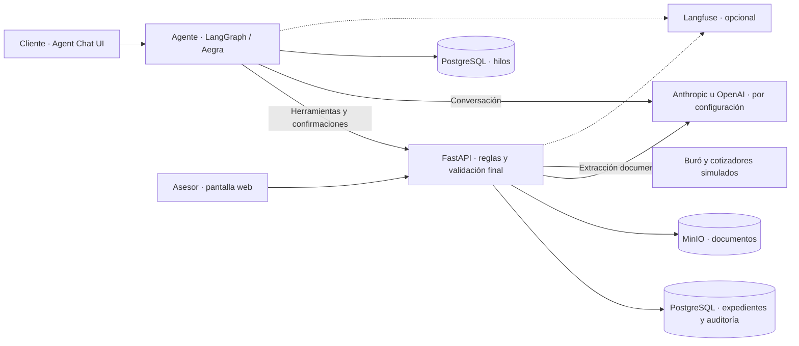

# Auto Equity Agent

Agente conversacional para preparar un expediente de crédito con garantía de auto: elegibilidad, perfilamiento, ofertas, elección del cliente y validación documental. Termina en **listo para revisión financiera**, **corrección** o **revisión humana**; no aprueba ni desembolsa créditos.

Proyecto de entrevista con datos y políticas sintéticos. Buró y cotizadores son simulados.

## Entrega del challenge

**[Leer el documento de entrega](docs/entrega.md)** — punto de entrada para la evaluación: los seis puntos técnicos del challenge, diagramas, decisiones y trade-offs, evidencia de ejecución, límites conocidos y guiones de demostración.

## Cómo funciona

El cliente conversa con el agente en **Agent Chat UI** y completa la solicitud por etapas, respondiendo una pregunta a la vez:

1. **Auto:** el agente pregunta por titularidad, adeudos y segunda llave. Con las respuestas confirmadas, el sistema aplica las reglas de elegibilidad para continuar o rechazar la solicitud.
2. **Perfil:** recopila datos personales, empleo e ingresos. El cliente revisa y confirma la información en una tarjeta antes de avanzar.
3. **Ofertas:** el sistema consulta el buró y los cotizadores simulados. El agente explica las opciones; el cliente elige y confirma una. Si falta la segunda llave, su costo se incorpora al plan.
4. **Documentos:** solicita identificación, comprobante de ingresos y propiedad del auto. El sistema extrae los datos y los contrasta con lo declarado y la oferta elegida; si encuentra discrepancias, pide correcciones o abre una revisión humana.
5. **Resultado:** una comprobación final verifica que la evidencia esté vigente, sea consistente y no haya pendientes. Solo entonces el expediente queda **listo para revisión financiera**, sin aprobar ni desembolsar el crédito.

**LangGraph/Aegra** coordina la conversación y llama a las herramientas de **FastAPI**, donde se validan permisos y se ejecutan las reglas de negocio. PostgreSQL conserva el expediente y su auditoría; MinIO guarda los documentos. La IA interpreta y propone acciones, pero no confirma por el cliente ni decide las transiciones del proceso.



## Arranque rápido

Requiere **Docker en ejecución, Compose v2** y **Python 3.10+**. La primera compilación necesita acceso a internet y puede tardar varios minutos. Ejecuta los comandos desde la raíz del repositorio.

### 1. Preparar la configuración

```bash
python3 scripts/bootstrap_env.py
```

El script crea `.env` con secretos locales y no sobrescribe uno existente. No publiques este archivo ni sus claves.

#### Variables de entorno: obligatorias y opcionales

**Para API, asesor y demos HTTP sin IA**, basta el `.env` generado. **Para conversar**, edita `.env` y elige una de las dos opciones de chat:

| Uso | Variables | Qué configurar |
| --- | --- | --- |
| Chat con OpenAI — obligatorio si lo eliges | `CHAT_PROVIDER`, `OPENAI_API_KEY`, `CHAT_MODEL` | `openai`, tu clave y un modelo explícito; por ejemplo, `gpt-4.1-mini`. |
| Chat con Anthropic — alternativa | `CHAT_PROVIDER`, `ANTHROPIC_API_KEY`, `CHAT_MODEL` | `anthropic` y tu clave; el modelo puede quedar vacío para usar el predeterminado del código. |
| Infraestructura — obligatoria, automática | `POSTGRES_PASSWORD`, `MINIO_ROOT_PASSWORD`, `S3_SECRET_ACCESS_KEY` | El script genera estos secretos; conserva las demás opciones de PostgreSQL/MinIO del ejemplo. |
| Lectura real de documentos — opcional | `EXTRACTION_PROVIDER`, `EXTRACTION_MODEL`, clave del proveedor | Conserva `fake` para fixtures. Para lectura real, elige `openai` o `anthropic` y su clave; OpenAI exige modelo explícito. |
| Langfuse — opcional | `LANGFUSE_ENABLED` | Deja `false`; para activarlo también necesitas URL, clave pública y clave secreta de Langfuse. |
| Costos estimados — opcional | `MODEL_PRICES` | El ejemplo incluye `gpt-4.1-mini`; otros modelos necesitan su tarifa. No cambia límites de consumo. |
| Puertos — opcionales | `API_PORT`, `AGENT_PORT`, `CHAT_UI_PORT` | Conserva `8000`, `2026`, `3000`, salvo que estén ocupados. |

El chat y la extracción real tienen costo y requieren acceso al modelo elegido. `fake` solo reconoce los documentos de `fixtures/documents/`; no lee archivos arbitrarios. Configurar una clave no selecciona proveedor ni activa la extracción real.

**[Guía de variables de entorno y cómo aplicarlas](docs/auto_equity_TDD.md#variables-de-entorno-para-docker-compose)**: nombres completos, configuración mínima y qué hacer si `.env` ya existe.

### 2. Iniciar los servicios

```bash
docker compose up -d --build
docker compose ps -a
```

Espera a que la API aparezca como `healthy` y a que `agent` y `chat-ui` estén en ejecución. `setup` y `minio-init` son tareas de preparación: terminar con `Exited (0)` es normal. Comprueba que [la API está lista](http://127.0.0.1:8000/readyz) y devuelve `"status": "ready"`; esto verifica base de datos y almacenamiento, no la clave de IA.

- **Chat:** http://localhost:3000
- **Asesor:** http://127.0.0.1:8000/asesor
- **API y contratos:** http://127.0.0.1:8000/docs

Estas direcciones usan los puertos de ejemplo. Si los cambias, ajusta las URLs; cambiar el puerto del chat también requiere ajustar el origen permitido en [Aegra](conversation/server/aegra.json).

### 3. Entrar al chat

Consulta los tokens de demo en tu terminal; no los publiques:

```bash
docker compose exec api cat /data/demo-credentials.json
```

Abre http://localhost:3000 y completa el formulario:

- **Deployment URL:** `http://localhost:2026`.
- **Assistant / Graph ID:** `auto_equity`.
- **LangSmith API Key:** copia solo el valor de `cliente-ana`, sin comillas. Aunque el campo se llame así, aquí va el **token local del cliente**, no una clave de LangSmith, OpenAI ni Anthropic.

Para entrar a `/asesor`, usa el token de `asesor-1`.

### 4. Recorrer las demos

Abre **un hilo nuevo por demo** y responde una pregunta a la vez. Cada guion indica qué enviar, qué tarjetas confirmar y qué documentos adjuntar. Usa solo los datos sintéticos incluidos; no información personal real.

| Guion paso a paso para el chat | Resultado esperado |
| --- | --- |
| [Ana: camino feliz](conversation/demo_ana.md) | Expediente listo para revisión financiera, no un crédito aprobado. |
| [Rechazo por elegibilidad del auto](conversation/demo_rechazo_auto.md) | El cliente confirma que no es titular: cierre antes de Buró y ofertas. |
| [Validación documental fallida](conversation/demo_validacion_documental.md) | Nómina que no respalda el ingreso: pedir corrección, sin marcar el expediente como listo. |
| [Revisión humana: chat y asesor](conversation/demo_revision_humana.md) | Dos rondas fallidas → lectura humana del asesor → revalidación y consulta del resultado en el chat. |
| [Sin segunda llave](conversation/demo_sin_segunda_llave.md) | Cotización de 3,000 MXN incorporada una vez al plan: 50,000 de efectivo y 53,000 financiados. |

Si falta la configuración de IA, el chat indicará qué variable necesitas. Tras cambiar las variables de IA en `.env`, aplícalas con `docker compose up -d --force-recreate api agent` y abre un hilo nuevo si cambiaste de proveedor o modelo; `docker compose restart` no recarga esas variables.

### 5. Detener y volver a iniciar

Desde la raíz del repositorio, detén todos los servicios sin borrar expedientes,
conversaciones, documentos ni credenciales:

```bash
docker compose stop
```

Para volver a iniciarlos:

```bash
docker compose up -d
```

No uses `docker compose down -v` para detener la demo: elimina los volúmenes y sus datos.

## Probar el proyecto

Con los servicios iniciados y `EXTRACTION_PROVIDER=fake`, ejecuta lo siguiente **solo en un entorno local desechable**: las demos crean expedientes y las pruebas de integración recrean la base derivada `_test`.

```bash
docker compose exec api python scripts/demo.py --scenario all
docker compose exec api python -m pytest tests -q
docker compose exec agent python -m unittest -q test_graph
```

Las demos HTTP cubren camino feliz, rechazo por titularidad, discrepancia de ingresos y falta de segunda llave; no sustituyen la conversación en el chat. Las pruebas no llaman a modelos reales. Las demos sí usan el extractor configurado y tendrían costo con Anthropic u OpenAI.

[CI y verificación aislada](docs/auto_equity_TDD.md#114-verificación-aislada-y-ci): build, pruebas y demos sin claves de IA. [Resultados y límites](docs/auto_equity_TDD.md#84-evidencia-y-limitaciones).

## Documentación

- [TDD](docs/auto_equity_TDD.md): contratos, políticas, operación, observabilidad y resultados detallados.
- [Challenge original](tdd/challenge_auto_equity_agent.pdf): requisitos del ejercicio.
