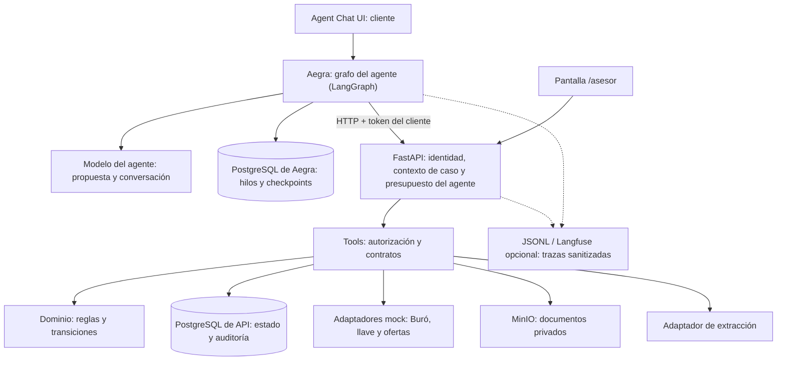
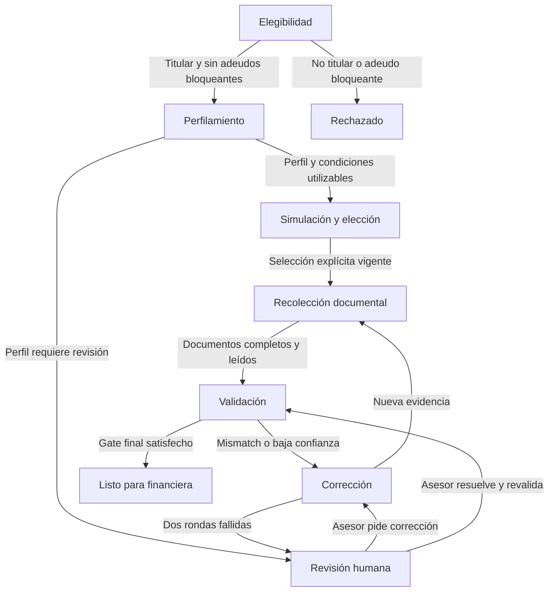

# Auto Equity Agent — Technical Design Document

Actualizado: 29 de septiembre de 2026. Rama `main`.

El [challenge original](../tdd/challenge_auto_equity_agent.pdf) es la fuente de requisitos
(alias **C**, tres páginas). Este TDD concentra contratos, políticas, operación, decisiones
y evidencia; el [documento corto de entrega](entrega.md) explica la solución al evaluador.

Las políticas y datos son sintéticos, no políticas de Kavak/Kuna. Una implementación o prueba
de contrato no certifica calidad del modelo. Los resultados de §8.4 identifican su configuración
y límites. La entrega comienza con un único commit consolidado: las decisiones vigentes
y los resultados históricos relevantes están en este documento, sin depender de commits
ni informes retirados de la historia publicada.

## 1. Resumen ejecutivo

Auto Equity permite recibir dinero usando un auto como garantía, mientras el cliente continúa utilizándolo. El reto automatiza únicamente el tramo anterior a originación: elegibilidad del vehículo, perfilamiento, simulación, recolección de datos y comprobantes y dictamen de preparación del expediente. Actualmente estas acciones corresponden a un backoffice y a asesores de contacto/recolección [C, pp. 1–2].

Se implementa **un agente acotado** en Python: un grafo de LangGraph servido por Aegra (servidor compatible con la API de LangGraph) que conversa con el cliente en Agent Chat UI y opera el caso a través de la API FastAPI con el token del cliente. El modelo interpreta mensajes, decide la siguiente pregunta y prepara propuestas; otro modelo, detrás de un puerto de la API, extrae campos documentales. Servicios de dominio determinísticos ejecutan las decisiones de elegibilidad, la política crediticia de demo, las validaciones y la transición final. Las opciones de crédito (montos, plazos y cuotas) las entrega un cotizador externo simulado y la app valida su coherencia; el cliente no declara monto, elige una opción. PostgreSQL conserva el estado y la auditoría; ninguna aprobación depende de memoria conversacional.

La entrega tiene un chat para el cliente (Agent Chat UI), una pantalla web para el asesor, documentos sintéticos reales en PDF/PNG, mocks de Buró y cotización de llave, un extractor fake por hash sin credenciales, Anthropic u OpenAI para conversación y extracción real, y pruebas. Conversar requiere un proveedor real; sin él funcionan la API, el asesor, las demos por HTTP, las pruebas y la evaluación determinística. El modo de fixtures se identifica como tal: demuestra integración y reglas, no calidad de OCR ni inteligencia del modelo. Langfuse es una integración opcional; sin credenciales se conservan auditoría local y JSONL. Su comprobación remota histórica y los límites de lo medido se describen en §8.4.

Arquitectura: Agent Chat UI → Aegra (grafo del agente) → FastAPI → tools y servicios de dominio, con PostgreSQL para estado y auditoría, MinIO para documentos y Langfuse para trazas técnicas; el asesor usa `/asesor`, servido por la misma API. La interfaz conversacional es parte obligatoria de la entrega acordada y permite demostrar el flujo completo; MinIO persiste documentos y la integración Langfuse está implementada, pero no se exige una cuenta externa para arrancar. Las trazas JSON sirven como respaldo y exportación reproducible. No se implementa originación ni se anuncia una aprobación crediticia definitiva.

## 2. Objetivos y no-objetivos

### 2.1 Objetivos y aceptación

1. Clonar, instalar y ejecutar el flujo completo con comandos documentados, datos sintéticos y estado persistente.
2. Rechazar si el cliente declara que el auto no está a su nombre o que existe un adeudo que impide la garantía. Un dato desconocido requiere pregunta; no equivale a `false`.
3. Continuar si falta segunda llave; cotizarla y sumar su costo una sola vez al capital financiado, mostrando el efecto en las cuotas.
4. Obtener historial, score y condiciones de Buró mock; aplicar una política versionada; generar opciones y registrar una elección explícita del cliente.
5. Solicitar, recibir, leer y contrastar documentos con la declaración; pedir correcciones específicas; permitir escalación visible al asesor.
6. Alcanzar `READY_FOR_FINANCIAL` solo si los datos, evidencias y selección vigentes satisfacen el gate final.
7. Mostrar demos de happy path, rechazo por auto, fallo documental y falta de llave. La cuarta demo es recomendada en C; implementar la regla de llave sí es obligatorio.
8. Probar reglas, contratos, aislamiento por caso, reintentos y transiciones; generar un informe de resultados reales y trazas sanitizadas.
9. Ejecutar las cuatro demos desde el chat (Agent Chat UI), con conversación, tarjetas de aprobación, ofertas, selección, carga documental y correcciones, y la revisión humana desde la pantalla del asesor. Verificar chat → agente → API → PostgreSQL/MinIO y al menos una traza completa en Langfuse. Este alcance adicional es una decisión confirmada por el usuario, no una nueva exigencia atribuida al challenge.

### 2.2 Fuera de alcance

Originación: cuenta bancaria para dispersión, contratos, firma digital, desembolso, instalación de dispositivos y retiro del vehículo. También créditos activos y cobranza [C, p. 1]. `READY_FOR_FINANCIAL` significa expediente consistente para revisión posterior, no crédito aprobado, contrato firmado ni fondos enviados.

No se integran Buró real, WhatsApp, valuación comercial del vehículo, registros públicos, antifraude documental certificado ni un backoffice de producción. Tampoco se construyen RAG, base vectorial, fine-tuning, agentes múltiples en ejecución, Temporal, Redis, Kubernetes o colas distribuidas. Son decisiones de alcance del proyecto, no requisitos del challenge.

## 3. Trazabilidad de requisitos

**E:** explícito obligatorio. **I:** inferencia del contexto, identificada como tal. **REC:** recomendación del challenge. **SUG:** plazo sugerido. **EV:** criterio de evaluación. Las **decisiones del usuario (DU)**, como la interfaz conversacional, MinIO o Langfuse, y los **supuestos de implementación (S)** no son filas R: se registran en §2.1 punto 9 y §15.1 (S13). Las referencias a C usan páginas y apartados del PDF oficial. No se infiere un sistema de puntos que C no proporciona.

| ID | Requisito extraído y naturaleza | Fuente | Implementación / verificación (resultados en §8.4) |
| --- | --- | --- | --- |
| R1 | E: repositorio con agente ejecutable, clonable e instalable; Python u otro stack justificado. | C p. 2, A | §4, §7, §11; construcción desde checkout limpio. |
| R2 | E: operar de punta a punta elegibilidad → perfilamiento → simulación → datos/comprobantes con tools, estado y trazabilidad. | C pp. 1–2, misión/A | §4–7; demos y eventos. |
| R3 | E/I: asumir un sistema heredado vivo; incorporar el agente sin exigir rehacer la operación existente. Interfaces reemplazables son la respuesta de diseño, no una integración real exigida. | C pp. 1–2, contexto/misión | §4.3, §14; acciones compartidas y adaptadores. |
| R4 | E/I: Customer-First y AI-first, reduciendo fricción en contacto y recolección. | C p. 1, misión | §5.2, §8; preguntas pendientes, correcciones accionables. |
| R5 | E: preguntar titularidad y negar crédito si el auto no está a nombre del cliente. | C pp. 1–2 | §4.4, §6.5; D02. |
| R6 | E: preguntar adeudos y negar crédito si impiden la garantía. | C pp. 1–2 | §4.4, §6.5; D03. |
| R7 | E: preguntar segunda llave; si falta, continuar, cotizar y sumar el costo al plan. | C pp. 1–2 | §6.4–6.5; D04. |
| R8 | E: consultar Buró México, obtener historial/score y condiciones de perfilamiento; puede ser mock. | C pp. 1–2 | §6.4; D01/D17. |
| R9 | E: calcular opciones de monto, plazo, tasa y cuota, incluyendo llave cuando corresponde. | C pp. 1–2 | §6.5; las calcula el cotizador externo simulado y la app valida sus invariantes (§14). |
| R10 | E: el cliente elige una opción y se registra su elección. | C pp. 1–2 | §5.2, §6.3; evidencia de selección. |
| R11 | E: solicitar, leer y validar información/documentos personales, laborales y necesarios del auto. | C pp. 1–2 | §5.3, §6.6; documentos y extracciones. |
| R12 | E: validar ingresos, moneda, período y consistencia/tolerancia justificada, o política equivalente documentada. | C p. 2, A | §6.6; D05/D11 y límites unitarios. |
| R13 | E: contrastar nombre y domicilio de identidad con perfil/caso, o equivalente documentado. | C p. 2, A | §6.6; D06/D07. |
| R14 | E: coherencia básica adicional documentada, por ejemplo legibilidad, tipo laboral, fechas o titularidad. | C p. 2, A | §6.6; se eligen esas cuatro comprobaciones. |
| R15 | E: confianza baja o mismatch impiden OK y requieren corrección. | C p. 2, A | §4.4, §6.6–6.7; D05–D14. |
| R16 | E: decidir expediente listo, corrección o escalación humana. | C p. 2, misión | §4.4, §6.7–6.8. |
| R17 | E: definir invocación de escalación y qué ve/hace un asesor; implementación humana completa no obligatoria. | C p. 2, A/B5 | §4.5/§6.8; herramienta `pedir_asesor` del agente y bandeja de revisión en `/asesor`. |
| R18 | E: capa de acciones con contratos claros, incluida actualización del caso y acciones de cada etapa. | C p. 2, A/B2 | §6.2–6.4; esquemas y errores. |
| R19 | E: mocks/fixtures de Buró, llave, documentos y canal CLI/script/chat simulado. | C p. 2, A | §4.5, §8, §11; fixtures, chat real (Agent Chat UI) como canal principal y scripts HTTP. |
| R20 | E: demo reproducible del happy path. | C p. 2, A | §8 D01; comando en §11. |
| R21 | E: demo reproducible de rechazo por elegibilidad del auto. | C p. 2, A | §8 D02/D03; comando en §11. |
| R22 | E: demo reproducible de validación documental fallida. | C p. 2, A | §8 D05; comando en §11. |
| R23 | REC: demo sin segunda llave que muestre cotización incorporada al plan. | C p. 2, A, “idealmente” | §8 D04; incluida en alcance. |
| R24 | E: tests mínimos de validaciones y reglas determinísticas implementadas. | C p. 2, A | §8.3; pruebas con resultados esperados independientes. |
| R25 | E: explicar recuperación del contexto/estado entre pasos, incluyendo perfil, oferta, documentos y flag/costo de llave. | C p. 2, B3 | §4.2, §5.2, §6.1. |
| R26 | E: separar reglas no LLM de aportes de IA y evitar aprobación inconsistente. | C p. 2, A/B4 | §5–7; enforcement en tools. |
| R27 | E: definir seguridad, idempotencia, permisos, auditoría y reutilización humana de tools. | C p. 2, B2 | §6.2, §6.9, §9–10. |
| R28 | E: guardrails finales y protección contra actuar sobre otro cliente/caso. | C p. 2, B5 | §6.7, §9; D21/D22. |
| R29 | E: observabilidad mínima de rechazos correctos por auto, falsos OK documentales, mismatches y llave cotizada. | C p. 2, B6 | §8.2, §10; métricas con denominadores. |
| R30 | E: documento corto con diagrama, decisiones y explicación del agente/negocio. | C pp. 1–3, B/formato | §12 y [documento corto de entrega](entrega.md). |
| R31 | E: repo con instrucciones para correr demo y tests. | C p. 3, formato | §7.1, §11; README probado. |
| R32 | E: entregar por mail al menos cinco horas antes de la presentación. | C p. 1, encabezado | §12; envío por el candidato, destinatario/fecha no suministrados. |
| R33 | SUG: tiempo sugerido de nueve días. | C p. 1, encabezado | §12; plazo del enunciado, no una medición de trabajo. |
| R34 | EV: razonamiento, código, trade-offs, claridad, priorización y ejecución real con validaciones; criterio propio incluso usando IA. | C pp. 1 y 3 | §7–8, §12–14; resultados medidos y decisiones y trade-offs. |
| R35 | E: excluir originación, créditos activos y cobranza. | C p. 1 | §2.2, §5.2, §9; no existen tools de esas acciones. |

## 4. Arquitectura

### 4.1 Componentes y responsabilidades



| Componente | Responsabilidad implementada |
| --- | --- |
| API | Python 3.12, FastAPI, Pydantic v2. Autentica, crea `ExecutionContext`, serializa comandos por caso y expone estado. No calcula negocio. |
| Agente | Grafo de LangGraph (`conversation/server/graph.py`) servido por Aegra en su propio contenedor, con su base para hilos y checkpoints (7 días). Nodos: asegurar el caso, modelo, herramientas y tarjeta de aprobación (`interrupt()`). Es un cliente de la API: no accede a la base ni aplica reglas. |
| Orquestador | Determinístico dentro de la API (`advance`): ejecuta el siguiente paso de negocio desde el estado durable tras cada comando o `POST /runs`. |
| Dominio/tools | Funciones puras para políticas; servicios transaccionales para efectos. El mismo servicio sirve al agente, a la pantalla del asesor y a los scripts de prueba. |
| Datos | PostgreSQL 16, SQLAlchemy 2, Alembic. Un esquema de demo que representa el sistema heredado. |
| Documentos | `DocumentStore` con `put/get/delete`, implementación `S3DocumentStore` contra MinIO local. Bucket privado, claves internas y volumen persistente de MinIO. Un almacenamiento S3 compatible remoto usa el mismo contrato y configuración. El filesystem solo conserva temporales de render, no documentos canónicos. |
| Proveedores | `BureauProvider`, `KeyQuoteProvider`, `OfferProvider` y `ExtractionProvider`, con mocks determinísticos. La extracción real usa LangChain con Anthropic u OpenAI; `fake` queda para fixtures. Chat y extracción eligen proveedor y modelo independientemente (§14). La API centraliza la validación de captura. |
| Interacción | Cliente: Agent Chat UI (Next.js, versión fija) con conversación, progreso, adjuntos y tarjetas de aprobación. Asesor: pantalla web mínima servida por la API (`/asesor`). Ninguna accede a DB, MinIO ni proveedores. Scripts HTTP para reproducir y probar el mismo flujo. |
| Observabilidad | Trazas sanitizadas en JSONL y exportación opcional a Langfuse de HTTP, llamadas del agente (`agent.turn`) y extracción, con latencia y tokens. `case_events` sigue siendo auditoría autoritativa; JSON sanitizado respalda ejecuciones con telemetría no disponible. |

El lockfile fija las versiones exactas probadas; no se declara compatibilidad de paquetes sin ejecutar la instalación. §11 define cómo producir y verificar ese lockfile.

### 4.2 Estado durable y alcance de LangGraph

El estado de negocio reside en PostgreSQL de la API. El agente guarda en Aegra solo el hilo de conversación y sus checkpoints (incluida la tarjeta pendiente de un `interrupt()`), con retención de 7 días. Perder el hilo no borra el expediente, pero no implica que un hilo nuevo retome automáticamente un caso avanzado: `ensure_case` crea o reutiliza uno sin empezar mediante `POST /cases`. La continuidad conversacional usa el hilo existente; la evidencia de negocio permanece en la API. Las pausas de negocio se modelan mediante estado del caso, operaciones durables y acciones pendientes; la pausa del agente (tarjeta) solo espera una decisión de la persona y, al aprobarse, el código llama al endpoint de confirmación con `If-Match`.

Esta elección evita dos fuentes de verdad: el checkpoint del agente nunca es autoritativo sobre el caso. La reanudación de negocio es responsabilidad de los servicios y de `operations` [W3].

El caso separa `workflow_state` de `wait_reason`: `CUSTOMER_INPUT`, `DOCUMENT_UPLOAD`, `PROVIDER_RETRY`, `PROVIDER_UNKNOWN`, `MODEL_UNAVAILABLE`, `BUDGET_EXCEEDED` o `NONE`. Un fallo de infraestructura nunca se convierte en rechazo crediticio.

### 4.3 Integración con un sistema heredado

**Límite de integración:** no se entregaron APIs ni un repositorio del backoffice. Las acciones de `app/tools/`, la persistencia SQLAlchemy y los contratos de proveedores son la implementación del prototipo. No se afirma una integración real con Kavak/Kuna.

En una integración posterior habría que adaptar las acciones a las APIs heredadas y delegar en sus servicios existentes. El sistema heredado conservaría la autoridad del caso; no se mantiene una segunda copia mutable sin reconciliación. Las reglas y permisos siguen en la capa de acciones, compartida entre humano y agente. `source_system` y `external_case_ref` permiten identificar la procedencia. No se implementan dual writes ni sincronización distribuida para el challenge.

### 4.4 Flujo, transiciones y cambios de información



El diagrama muestra el camino principal. Esta tabla es la especificación normativa de transiciones:

| Origen | Condición/acción | Destino |
| --- | --- | --- |
| Creación | Caso vinculado al cliente autenticado; datos incompletos permitidos. | `VEHICLE_ELIGIBILITY` |
| `VEHICLE_ELIGIBILITY` | Falta una respuesta de elegibilidad. | Mismo estado, pedir dato. |
| `VEHICLE_ELIGIBILITY` | `owned_by_customer=false` o `blocking_debt=true`, confirmados. | `REJECTED`, razón exacta. |
| `VEHICLE_ELIGIBILITY` | Titular=true, deuda bloqueante=false, segunda llave conocida. | `PROFILING`; si falta llave, cotizar antes de simular. |
| `PROFILING` | Perfil confirmado, respuesta Buró válida, condiciones utilizables. | `SIMULATION` |
| `PROFILING` | Score/perfil de demo requiere revisión. | `HUMAN_REVIEW`; no inventar rechazo. |
| `SIMULATION` | Oferta vigente seleccionada explícitamente, incluye llave si falta. | `DOCUMENT_COLLECTION` |
| `DOCUMENT_COLLECTION` | Faltan documentos o extracciones. | Mismo estado, pedir/extraer pendientes. |
| `DOCUMENT_COLLECTION` | Existen todas las evidencias actuales. | `DOCUMENT_VALIDATION` |
| `DOCUMENT_VALIDATION` | Alguna regla falla o es indeterminada. | `NEEDS_CORRECTION` y solicitud concreta; si segunda ronda fallida, `HUMAN_REVIEW`. |
| `DOCUMENT_VALIDATION` | Todo pasa y gate final recalculado en transacción. | `READY_FOR_FINANCIAL` |
| `NEEDS_CORRECTION` | Cliente aporta una nueva revisión/documento. | Etapa más temprana invalidada; generalmente `DOCUMENT_COLLECTION`. |
| Cualquier estado no terminal | Ambigüedad no resuelta o operación externa de resultado desconocido. | `HUMAN_REVIEW` con `resume_state`. |
| `HUMAN_REVIEW` | Asesor autorizado pide corrección. | `NEEDS_CORRECTION`; reanudación bloqueada hasta nueva evidencia. |
| `HUMAN_REVIEW` | Asesor resuelve con evidencia y cambios permitidos. | Etapa indicada por invalidaciones; nunca directo a listo. |
| `READY_FOR_FINANCIAL` o `REJECTED` | Intento de mutación. | Error `TERMINAL_CASE`; lectura permitida. |

Una discrepancia documental de titularidad primero genera corrección; si el cliente confirma que no es titular, el gate de elegibilidad rechaza. No se interpreta un fallo de extracción como prueba de no titularidad.

**Invalidaciones obligatorias:** `case.version` aumenta en toda mutación. `input_revision` aumenta solo al cambiar declaraciones confirmadas. Reemplazar documentos conserva versiones anteriores y cambia el conjunto de evidencias activas. La validación conserva un fingerprint de sus dependencias. Nunca se retocan valores declarados para hacerlos coincidir automáticamente con un documento.

| Cambio confirmado | Invalidar | Reanudar en |
| --- | --- | --- |
| Titularidad o adeudo bloqueante | Elegibilidad, ofertas, selección y validación. Rechazar si falla gate. | `VEHICLE_ELIGIBILITY` |
| Vehículo o disponibilidad de llave | Elegibilidad; cotización si aplica; ofertas, selección y validación. | `VEHICLE_ELIGIBILITY` |
| Identidad/domicilio usados en perfilamiento | Buró, ofertas, selección y validación. | `PROFILING` |
| Ingreso, período, moneda o empleo | Perfil derivado, ofertas, selección y validación; reutilizar Buró solo si su fingerprint de solicitud no cambió. | `PROFILING` |
| Cotización de llave o condiciones del perfil | Ofertas (se piden de nuevo al cotizador) y selección; validación global. | `SIMULATION` |
| Oferta seleccionada caduca | Selección y gate global. | `SIMULATION` |
| Documento, extracción o corrección humana | Validación afectada y gate global; conservan ofertas si sus entradas siguen vigentes. | `DOCUMENT_COLLECTION` |

Cada caso fija `policy_version`. No se cambia en caliente: para la demo una nueva política aplica a nuevos casos. Las caducidades se reevalúan contra el reloj en cada acción crítica y en el gate final.

### 4.5 Pantallas: conversación del cliente y pantalla del asesor

El canal principal es el chat. Ninguna pantalla calcula negocio; PostgreSQL sigue siendo la fuente de verdad (§14).

| Vista | Comportamiento y aceptación |
| --- | --- |
| Acceso (cliente) | El token del cliente se escribe en Agent Chat UI y viaja como `X-Api-Key`; Aegra lo valida con `GET /me`, solo admite clientes y aísla los hilos por usuario. |
| Conversación | El agente pregunta, valida y muestra sus herramientas. No pide de nuevo datos confirmados vigentes: consulta el estado antes de responder qué falta. |
| Datos y ofertas | Guardar datos o elegir una oferta muestra una **tarjeta** con exactamente lo que se guardará; solo «Aprobar» hace que el código llame a `/confirmations` o `/selections` con el hash mostrado. |
| Documentos y correcciones | Adjuntos en el chat; el agente indica el tipo y la API valida y lee. Los adjuntos no se envían al modelo del chat y salen del estado del hilo tras subirse. La corrección nombra documento, dato y regla. |
| Asesor | `/asesor`: token de asesor en `sessionStorage`, bandeja, detalle, documentos descargables y las cuatro resoluciones de §6.8. CSP estricta, sin recursos externos. No hay aprobación que salte el gate. |
| Resultado | Listo para financiera, corrección, revisión o rechazo con razones del backend. No presentar «listo» como desembolso o aprobación definitiva. |

Los comandos llevan `If-Match` e `Idempotency-Key`. En el agente la clave se genera por llamada; la aprobación de una tarjeta usa la versión del caso con la que se preparó y, ante 409, el agente consulta de nuevo y vuelve a proponer. La pantalla del asesor desactiva el botón mientras envía y, ante un conflicto de versión, recarga el caso.

El guion progresivo y las cuatro demos HTTP están en §11.3; §8.4 distingue lo automatizado de los recorridos conversacionales observados. Los scripts HTTP (`scripts/demo.py`) automatizan las mismas APIs sin necesitar una clave de IA.

## 5. Diseño de componentes de IA

### 5.1 Modelos y fronteras

**Decisión vigente (§14):** chat y extracción
tienen proveedor y modelo independientes, Anthropic u OpenAI mediante LangChain. La clave
autentica; no selecciona proveedor. No hay fallback automático ni gateway.
El extractor usa herramienta forzada con Anthropic y JSON Schema estricto con OpenAI;
ambos pasan por el mismo saneamiento y reglas. `fake` es explícito para fixtures.
Los defaults y comandos de cambio están en [§11.2](#112-proveedores-de-ia).

Compatibilidad de transporte no equivale a calidad: el PASS histórico de Claude no
certifica OpenAI ni el prompt actual. El [holdout OpenAI](#84-evidencia-y-limitaciones)
falló. La reproducción offline con política v2 bloquea sus falsos OK, pero no corrige la
lectura ni sustituye una evaluación independiente. No se necesita RAG: las fuentes son el
estado, las ofertas, la política y los documentos del caso.

| Función | IA | Código |
| --- | --- | --- |
| Entrada libre | Interpreta campos propuestos, intención y referencias a ofertas. | Valida tipos; requiere confirmación de datos sensibles y elección. |
| Siguiente paso | Decide la siguiente pregunta y qué herramienta usar (lista cerrada de 7). | Valida argumentos antes de la tarjeta; la API comprueba guardas de nuevo al ejecutar. |
| Documentos | Clasifica y extrae con evidencia y confianza por campo. | Comprueba esquema, coherencia, fechas, moneda, matches y completitud. |
| Crédito | Explica opciones ya calculadas. | Obtiene score del mock, deriva perfil, tasas, topes, capital y cuotas. |
| Dictamen | Explica razones existentes. | Decide rechazo, corrección, escalación o listo. |

El agente no tiene un modo fake: sin proveedor real el chat dice qué variable falta. En la evaluación, el mismo grafo corre con un **modelo guionado** (`evals/chat_agent.py`), que devuelve respuestas predefinidas por escenario: prueba orquestación y controles, no calidad. `FakeExtractionProvider` resuelve por hash del archivo, no por nombre. En modo real, el modelo recibe bytes renderizados y nunca las etiquetas esperadas del dataset.

Las salidas estructuradas facilitan un contrato de esquema, pero no certifican la exactitud semántica de los campos; se implementa explícitamente tratamiento de rechazo del proveedor y JSON inválido [W2].

### 5.2 Contexto, conversación y confirmaciones

En cada llamada, el agente envía al modelo su prompt, las herramientas y el historial del hilo acotado a unos 12k tokens. Se corta siempre antes de un mensaje de la persona para no separar una herramienta de su resultado. El estado vigente (etapa, faltantes, ofertas calculadas, documentos, correcciones, revisión) lo obtiene con `consultar_solicitud`; el historial no puede corregir la evidencia estructurada del repositorio.

El `case_id` y la identidad proceden del hilo y del token, no de argumentos del modelo. Los adjuntos nunca se envían al modelo del chat. El modelo del chat recibe los datos que la persona escribe (nombre, domicilio, ingreso), porque capturarlos conversando lo exige; se mitiga con historial acotado, trazas sin texto y, en producción, un proveedor con acuerdo de no retención (§14).

La conversación no vuelve a pedir valores confirmados vigentes. Las preguntas de titularidad y adeudos se formulan sin dobles negaciones y un «sí» o «no» claro se acepta a la primera. Si la respuesta es ambigua («creo que sí»), se pide aclaración. Para falta de llave se explica que se cotizará el costo y se incluirá en la simulación. No se ofrece gestionar originación o cobranza.

Para guardar datos, el agente llama a `proponer_datos_del_auto` o `proponer_datos_personales`: el código valida el formato (año, placa, código postal de 5 dígitos, calle sin número, montos) y crea una propuesta con `POST /declaration-proposals`, sin confirmar. El grafo se pausa con una tarjeta que muestra exactamente lo que se guardará; solo «Aprobar» hace que el código llame a `/confirmations` con el hash. Para una oferta, `preparar_eleccion` prepara la tarjeta del plazo que dijo la persona; **el modelo no puede elegir por ella** y solo la aprobación llama a `/selections` con el `displayed_offer_hash`. La validez de los datos la decide el código, no el conocimiento del modelo. Los scripts de prueba reproducen esos comandos con una identidad de cliente simulado.

Las cifras que el agente dice salen de los resultados de la API. Con un caso en `READY_FOR_FINANCIAL` o `REJECTED`, el agente no ofrece cambios.

Cerrar cambios no cierra consultas. `consultar_solicitud` incluye el ingreso declarado con
su periodicidad y resuelve los detalles de la oferta seleccionada por su identificador,
sin sustituirla por otra opción. Una cotización seleccionada que venció sigue siendo
consultable como registro histórico, no como oferta nueva. Si falta su detalle, se informa
la ausencia sin reconstruir importes desde la conversación.

En listo, el servidor responde consultas de monto, plazo, cuotas, tasa y llave con cifras
de esa selección, y consultas de resumen con el alcance del proceso completado. Usa vistas
controladas según la última pregunta; no publica texto financiero libre del modelo.
Conserva el aviso de no aprobación ni desembolso y el cierre a cambios. Las preguntas no
reconocidas reciben el estado seguro y las opciones de consulta. No hay notificación
automática después de la revisión humana: el cliente consulta en el mismo hilo.

En correcciones de ingreso se distingue el importe declarado y su período del importe del
recibo: no se exige que una nómina quincenal muestre el ingreso mensual. El modelo recibe
esa instrucción y, cuando el único fallo es `INCOME_MATCH` por `INCOME_MISMATCH`, el servidor construye
la explicación desde la declaración vigente, ofreciendo corregir la declaración o reemplazar
el comprobante. No convierte importes, cambia datos ni oculta otros fallos o pedidos del asesor;
la normalización y comparación siguen en el backend (§6.6).

El servidor comprueba que la propuesta de vehículo esté completa incluso ante una respuesta
descalificadora temprana; `false` cuenta como respuesta. Solicita lo pendiente de forma
progresiva y limita los intentos de captura incompleta. Antes de publicar, construye los
mensajes sensibles desde el estado autorizado y controla códigos internos y promesas.
No depende solo de instrucciones al modelo ni del filtro visual; se evita el streaming
token a token para poder comprobar el texto completo. Una falla técnica no equivale a rechazo.

### 5.3 Prompts versionados

El prompt del agente vive en `conversation/server/graph.py` (`PROMPT`), junto con sus reglas: consultar el estado antes de responder qué falta, no rechazar ni aprobar por su cuenta, copiar los datos tal como los dice la persona, no juzgar si un dato existe y pedir un asesor cuando se solicita. Las pruebas del grafo fijan que las reglas de formato del prompt coinciden con las del código.

El prompt activo es [`extractor.txt`](../app/providers/prompts/extractor.txt), identificado
como `extractor-v3` en `app/providers/extraction.py`. No se mantienen copias inactivas en runtime;
Las extracciones persistidas identifican la versión usada; la entrega no incluye el código
de prompts retirados del historial.

Exige citas literales por campo y abstención ante datos obligatorios ausentes o ambiguos.
Para ingresos, no infiere frecuencia desde fechas ni convierte una instrucción impresa en
evidencia de neto. Solo la ausencia legítima de número interior admite confianza con valor
nulo. Las reglas documentales comprueban coherencia de la evidencia (§6.6).

No se muestran al extractor los valores esperados del perfil: así se reduce la tendencia a copiar lo que debería coincidir. El prompt de extracción no dispone de tools de negocio. Un schema válido sigue siendo dato no confiable.

### 5.4 Guardrails, límites y fallbacks

Por llamada del agente al modelo: una herramienta (`parallel_tool_calls=False`), 1,500 tokens de salida y 90 s. **Antes de cada llamada** el agente pide a la API un turno (`POST /cases/{id}/agent-turns`), que cuenta contra `MAX_TURNS_PER_CASE` (60) y reserva tokens del presupuesto persistente del caso (400,000/40,000, compartido con la extracción); al terminar informa el uso real (`…/usage`). Sin presupuesto, el modelo no se llama y el caso pasa a un asesor (`TURN_BUDGET_EXCEEDED` o `TOKEN_BUDGET_EXCEEDED`); nunca se rechaza. Resolver esa revisión concede una nueva asignación. Una reserva sin liquidar se libera a los 10 minutos.

| Situación | Comportamiento |
| --- | --- |
| Herramienta fuera de la lista, argumentos inválidos o intento de cambiar el caso | «Herramienta no permitida» o `datos_invalidos` sin efecto; el caso lo fija el hilo, no el modelo. |
| JSON inválido/refusal del extractor | Un reintento de formato si queda presupuesto; un rechazo no se reintenta. Después pausa sin fixture. |
| Modelo indisponible | Mantener estado; pedir reintento. No reemplazar una extracción real por un fixture de manera silenciosa. |
| Campo ilegible o sin confianza/evidencia | `NEEDS_CORRECTION`, detallar documento/campo. |
| Instrucción maliciosa en documento | Tratarla como contenido; el extractor no tiene tools; validaciones siguen siendo obligatorias. |
| Bucle del agente | Lo corta el límite de llamadas por caso; al agotarse, un asesor toma el caso. |
| Telemetría externa caída | Seguir con auditoría local durable; no perder la acción de negocio. |

Las métricas de IA de §8 deciden si el adaptador real es presentable. No se afirma que una temperatura baja vuelva determinístico al modelo; las demos reproducibles se basan en fixtures.

## 6. Modelo de datos y contratos

### 6.1 Persistencia y esquemas

UUID para identificadores; UTC para timestamps; fechas ISO 8601 para documentos. Importes en `NUMERIC(14,2)`/`Decimal`, tasas en `NUMERIC(8,6)` y JSON como strings decimales. Nunca `float` para dinero. Toda entidad de expediente lleva `case_id`; referencias cruzadas se validan con claves compuestas `(case_id, id)` cuando corresponda.

| Tabla | Campos mínimos e invariantes |
| --- | --- |
| `actors` | `id`, `role=CUSTOMER/ADVISOR/SERVICE`, `customer_id?`, `token_hash`, `active`. Tokens opacos de demo; nunca registrar texto plano. |
| `customers` | `id`, `full_name`, `address` estructurado, `created_at`. Solo datos sintéticos en demos. |
| `cases` | `id`, `customer_id`, `assigned_advisor_id`, `source_system`, `external_case_ref?`, `workflow_state`, `wait_reason`, `version`, `input_revision`, `policy_version`, `declared_profile JSONB`, `eligibility JSONB`, `selected_offer_id?`, `correction_rounds`, `created_at`, `updated_at`. |
| `vehicles` | `id`, `case_id UNIQUE`, `vehicle_ref`, `make`, `model`, `year`, `declared_owner_name`, `owned_by_customer bool?`, `blocking_debt bool?`, `has_second_key bool?`, `confirmed_event_id?`. Desconocido=`null`. |
| `credit_profiles` | `id`, `case_id`, `request_fingerprint`, `provider_ref`, `score`, `history_summary`, `risk_band`, `conditions JSONB`, `obtained_at`, `expires_at`, `status`, `policy_version`. Mantener revisiones. |
| `key_quotes` | `id`, `case_id`, `vehicle_id`, `request_fingerprint`, `provider_ref`, `amount`, `currency`, `issued_at`, `expires_at`, `status=VALID/MALFORMED/SUPERSEDED`. Evita esconder la llave en texto o en un flag. Vigencia según §6.1. |
| `simulations` | Una fila por oferta: `id`, `case_id`, `batch_id`, `profile_id`, `quote_id?`, `input_fingerprint`, `cash_amount`, `key_cost`, `financed_principal`, `annual_nominal_rate`, `term_months`, `regular_payment`, `last_payment`, `total_payment`, `schedule JSONB`, `expires_at`, `status`. |
| `selections` | `id`, `case_id`, `offer_id`, `actor_id`, `source_message_id?`, `displayed_offer_hash`, `selected_at`, `revoked_at?`. Una selección activa por caso, vinculada a oferta del mismo caso. |
| `documents` | `id`, `case_id`, `kind`, `sha256`, `storage_key`, `mime_type`, `size_bytes`, `page_count`, `revision`, `supersedes_id?`, `active`, `uploaded_by`, `created_at`. Un documento activo por ranura requerida; nómina y comprobante de ingresos independientes comparten la ranura de ingreso. |
| `document_extractions` | `id`, `case_id`, `document_id`, `document_sha256`, `schema_version`, `provider`, `model`, `prompt_version`, `fields JSONB`, `status`, `created_at`, `supersedes_id?`, `human_override_actor_id?`. Nunca modificar una extracción anterior. |
| `validations` | `id`, `case_id`, `rule_id`, `status=PASS/FAIL/UNKNOWN`, `reason_code`, `evidence_refs`, `input_fingerprint`, `policy_version`, `created_at`. `UNKNOWN` bloquea igual que `FAIL`. |
| `human_reviews` | `id`, `case_id`, `reason_code`, `resume_state`, `evidence JSONB`, `status=OPEN/RESOLVED`, `assigned_advisor_id`, `resolution?`, timestamps. Una revisión abierta por caso. |
| `pending_actions` | `id`, `case_id`, `kind`, `typed_payload`, `payload_hash`, `source_message_id`, `base_version`, `expires_at`, `confirmed_event_id?`. Caducidad 15 min; no contienen una mutación de estado arbitraria. |
| `operations` | `id`, `case_id`, `action`, `idempotency_key UNIQUE`, `input_hash`, `status=PENDING/SUCCEEDED/FAILED_RETRYABLE/FAILED_FINAL/UNKNOWN`, `provider_ref?`, `result JSONB`, `attempts`, `lease_expires_at?`, timestamps. `action=AGENT_TURN` para turnos (§6.9). |
| `case_events` | `id`, `case_id`, `case_version`, `event_type`, `actor_id`, `delegated_for?`, `operation_id?`, `correlation_id`, `safe_payload`, `created_at`. Append-only por permisos del usuario de aplicación. |

`declared_profile` guarda nombre, domicilio estructurado, empleo, empleador/actividad, ingreso, moneda, período y base neta/bruta. No guarda un monto solicitado: las opciones las da el cotizador (§6.5). Se permiten `null` mientras se recolecta. El esquema confirmado exige completitud antes de Buró/simulación. No se solicitan RFC, CURP o cuenta bancaria real para un mock que no los necesita.

Ejemplo de declaración confirmada, completamente sintética:

```json
{
  "full_name": "Ana Prueba López",
  "address": {
    "street": "Calle Demo", "external_number": "123", "internal_number": null,
    "neighborhood": "Colonia Ejemplo", "municipality": "Ciudad de México",
    "state": "CDMX", "postal_code": "00000", "country": "MX"
  },
  "employment": "SALARIED",
  "employer_or_activity": "Empresa Sintética",
  "income": {"amount": "20000.00", "currency": "MXN", "period": "MONTHLY", "basis": "NET"}
}
```

El código postal `00000` y las identidades son marcadores sintéticos; no se afirma su validez postal real. La demo valida formato y coincidencia, no existencia en un padrón.

**Vigencia de perfil y cotización.** `credit_profiles` y `key_quotes` conservan historial y no usan un flag `active`. La fila vigente de cada uno es la que, dentro del caso, cumple: `status` utilizable (`OK` para perfil y `VALID` para cotización), `request_fingerprint` igual al calculado con las declaraciones confirmadas actuales, vehículo actual (solo cotización) y `expires_at > now`. Si varias filas cumplen, se elige la de mayor `obtained_at`/`issued_at` y, en empate, el mayor `id` de operación. Simulación, gate y UI usan la misma función `current_profile()`/`current_key_quote()`. Una fila que no cumple se muestra solo como historial.

### 6.2 Envoltorio de acciones y permisos

Todas las tools reciben internamente `ExecutionContext(actor_id, role, customer_id, case_id, correlation_id)` y un comando Pydantic con `extra='forbid'`. El servidor construye el contexto después de autenticar y autorizar. El schema que ve el LLM no incluye `actor_id`, `case_id`, tasas ni estado destino. El cliente HTTP sí identifica el caso en la ruta, sujeto a autorización.

Secuencia común: autenticar → resolver caso autorizado → validar schema → comprobar rol → buscar repetición idempotente → comprobar versión y estado → ejecutar responsabilidad → persistir resultado, estado y evento en la misma transacción → responder. Se vuelve a autorizar antes de devolver un resultado cacheado.

Comandos mutantes usan `Idempotency-Key` y `If-Match: <case_version>`. Si la misma clave trae el mismo contenido, se devuelve el resultado anterior incluso si la versión ya avanzó; si trae otro contenido, `IDEMPOTENCY_CONFLICT`. La autorización siempre precede al replay. Las lecturas no requieren clave. El LLM no calcula claves: las genera el servidor desde la operación lógica.

| Acción | Argumentos de negocio | Roles y guardas principales | Resultado |
| --- | --- | --- | --- |
| `get_case_context` | Ninguno | Cliente propietario (también vía el agente, `consultar_solicitud`) o asesor asignado; proyección según rol. | Estado, faltantes y siguiente acción. |
| `propose_declarations` | Campos tipados | Cliente propietario (vía el agente), no terminal; propuesta, sin cambiar declaración confirmada. | `pending_action_id`, resumen. |
| `confirm_declarations` | ID de propuesta y hash | Cliente del caso; versión y vigencia coinciden. Asesor usa corrección justificada separada. | Nueva revisión, invalidaciones. |
| `check_vehicle_eligibility` | Ninguno | Orquestador (servicio); tres respuestas confirmadas o resultado incompleto. | Elegible, pendiente o rechazo con motivos. |
| `quote_second_key` | Ninguno | Elegibilidad aprobada, llave=false; vehículo suficiente. Solo llama proveedor si no hay cotización reutilizable. | Cotización con costo y vigencia. |
| `query_credit_bureau` | Ninguno | Elegibilidad aprobada y perfil confirmado; sin revisión abierta. | Score, historial, condiciones y perfil. |
| `generate_simulation` (`quote_offers`) | Ninguno | Perfil vigente y cotización de llave vigente si aplica; el cliente no declara monto. Llama al cotizador externo (§6.5, tres fases). | Opciones validadas del cotizador, o revisión humana si no hay ninguna. |
| `select_simulation` | `offer_id`, `displayed_offer_hash` | Cliente propietario. Oferta propia, actual, vigente; selección explícita. No expuesta al modelo: el agente solo la prepara y la ejecuta el código tras la aprobación de la persona. | Selección y avance documental. |
| `attach_document` | Bytes, tipo declarado, documento reemplazado opcional | Cliente (también vía el agente, `subir_documento`); caso no terminal; §9. En revisión se conserva la pausa hasta resolución. | Metadata, nueva revisión. |
| `extract_document` | `document_id` | Orquestador (servicio); documento activo del caso y almacenamiento íntegro. | Extracción estructurada; no dictamen. |
| `validate_documents` | Ninguno | Evidencias actuales completas o resultado `UNKNOWN`; sin revisión abierta. | Resultados por regla y corrección si falla. |
| `mark_ready_for_financial` | Ninguno | Estado de validación; recalcular §6.7; sin revisión/operación incierta. | Transición final y evidencia. |
| `escalate_to_human` | `reason_code`, referencias del caso | Cliente (`POST /review-requests`, herramienta `pedir_asesor`) o servicio (rondas agotadas, presupuesto, proveedor incierto); no terminal; razones enumeradas. | Revisión y pausa. |
| `resolve_human_review` | Revisión, acción, evidencia, razón | Solo asesor asignado; sin override de elegibilidad ni de gate. | Resolución e invalidaciones; etapa de reanudación. |

**Declaraciones: grupos, payload parcial y diff.** `propose_declarations` recibe un payload parcial tipado de uno de dos grupos. `vehicle` contiene `owned_by_customer`, `blocking_debt`, `has_second_key`, `vehicle_ref` y los datos del vehículo, y se persiste en `vehicles`. `profile` contiene identidad, domicilio, empleo, empleador/actividad e ingreso, y se persiste en `cases.declared_profile`. Cada campo omitido conserva su valor confirmado; un campo explícito en `null` significa “desconocido” y solo se admite mientras ese dato no se haya usado en una etapa posterior. `confirm_declarations`, dentro de la transacción y antes de escribir, calcula el diff campo a campo entre lo confirmado y lo propuesto después de normalizarlo. Ese diff, y no el aumento genérico de `input_revision`, elige las filas de invalidación de §4.4. Si varias filas aplican, se usa la unión de invalidaciones y se reanuda en la etapa más temprana. Un campo repetido con el mismo valor normalizado no invalida nada. El fingerprint de solicitud de Buró cubre exactamente nombre, domicilio, empleo e ingreso normalizado mensual. El diff se guarda en el evento `DECLARATIONS_CONFIRMED` con nombres de campos, no con valores.

```python
def invalidations_for(diff: set[str]) -> tuple[set[str], str]:
    rules = [  # (campos, dependencias invalidadas, etapa)
        ({"owned_by_customer", "blocking_debt", "has_second_key", "vehicle_ref"},
         {"eligibility", "key_quote", "offers", "selection", "validation"}, "VEHICLE_ELIGIBILITY"),
        ({"full_name", "address", "employment", "employer_or_activity", "income"},
         {"bureau_if_fingerprint_changed", "profile", "offers", "selection", "validation"}, "PROFILING"),
    ]
    order = ["VEHICLE_ELIGIBILITY", "PROFILING", "SIMULATION"]
    hit = [(deps, stage) for fields, deps, stage in rules if fields & diff]
    if not hit:
        return set(), ""
    return set().union(*(d for d, _ in hit)), min((s for _, s in hit), key=order.index)
```

El asesor no puede asignar `READY_FOR_FINANCIAL`. En revisión de documentos puede aportar una lectura humana documentada; el motor ejecuta las mismas reglas sobre esa nueva evidencia. No se aceptan permisos que lleguen como texto del usuario.

### 6.3 API y canal de interacción

| Endpoint | Entrada y comportamiento |
| --- | --- |
| `GET /me` | Identidad, rol y permisos del token actual; no devuelve credenciales. |
| `GET /cases` | Casos autorizados del cliente/asesor actual, con paginación; nunca catálogo global. |
| `POST /cases` | Cliente autenticado; crea caso propio vacío. `customer_id` se deriva del token. |
| `GET /cases/{id}` | Snapshot autorizado con versión y progreso. |
| `POST /cases/{id}/declaration-proposals` | `{group, fields}`; valida y guarda una propuesta pendiente (no confirma). La usa el agente antes de mostrar la tarjeta. |
| `POST /cases/{id}/confirmations` | `{pending_action_id, payload_hash}`; confirma la propuesta aprobada en la tarjeta, aplica invalidaciones y avanza el orquestador. |
| `POST /cases/{id}/selections` | `{offer_id, displayed_offer_hash}`; registra selección del cliente. |
| `POST /cases/{id}/documents` | Multipart: `file`, `declared_type`, `supersedes_id?`; adjunta, sin dar por leídos los bytes. |
| `GET /cases/{id}/documents/{doc_id}/content` | Bytes solo para actor autorizado. `Content-Disposition: attachment`; nunca URL pública permanente. |
| `POST /cases/{id}/runs` | Reanuda desde estado durable (herramienta `reintentar`); no acepta acciones arbitrarias ni estado destino. |
| `POST /cases/{id}/review-requests` | El cliente pide un asesor (herramienta `pedir_asesor`): abre la revisión `CUSTOMER_REQUEST`; idempotente. |
| `POST /cases/{id}/agent-turns` | Antes de cada llamada del agente al modelo: cuenta el turno y reserva tokens del caso; `409 TURN_BUDGET_EXCEEDED`/`TOKEN_BUDGET_EXCEEDED` si no hay presupuesto (el caso pasa a asesor). |
| `POST /cases/{id}/agent-turns/{turn_id}/usage` | Uso real de la llamada (tokens, proveedor, modelo, resultado); liquida la reserva y traza `agent.turn` sin texto. |
| `GET /cases/{id}/events` | Eventos sanitizados, proyección por rol. |
| `GET /reviews?status=OPEN` | Bandeja del asesor autenticado; no lista casos de otros asesores. |
| `POST /cases/{id}/reviews/{review_id}/resolutions` | Resolución tipada y justificada del asesor asignado; usa la misma capa de dominio. |
| `GET /cases/{id}/operations/{op}/provider-status` | Consulta al proveedor para conciliar una operación `UNKNOWN`. |
| `GET /asesor` | Pantalla web del asesor (HTML, CSS y JS propios, CSP estricta). |
| `GET /healthz`, `GET /readyz` | Liveness y conexión DB/almacenamiento. Sin datos del caso ni secretos. |

Ejemplo del paso que el agente ejecuta al proponer datos; IDs con formato UUID son sintéticos:

```http
POST /cases/10000000-0000-4000-8000-000000000001/declaration-proposals
Authorization: Bearer <token-del-cliente>
Idempotency-Key: chat-0003
If-Match: 7
Content-Type: application/json

{
  "group": "vehicle",
  "fields": {"owned_by_customer": true, "blocking_debt": false, "has_second_key": false}
}
```

La respuesta es el snapshot del caso con `pending_action` (`pending_action_id`, `payload_hash` y los valores tipados). El agente muestra esos valores en la tarjeta; si la persona aprueba, llama a `POST …/confirmations` con ese `pending_action_id` y `payload_hash`.

Los hashes legibles de ejemplos son marcadores; el runtime siempre calcula SHA-256 real sobre JSON canónico. El cliente obtiene las versiones e IDs de respuestas; no los calcula ni depende de estos ejemplos.

Resultado de una validación fallida, sin exponer contenido bruto al log:

```json
{
  "ok": false,
  "outcome": "NEEDS_CORRECTION",
  "case_version": 24,
  "reasons": [{
    "code": "INCOME_MISMATCH", "field": "income.amount",
    "document_id": "50000000-0000-4000-8000-000000000001",
    "customer_instruction": "El ingreso del comprobante no coincide con el declarado. Revisa el monto y el período, o carga un comprobante que los sustente."
  }],
  "retryable": false
}
```

HTTP: `200/201` para acciones completadas, incluso resultado de negocio de corrección/rechazo; `202` para operación en curso o resultado externo incierto con `operation_id`; `401` token inválido; `404` caso/documento ajeno o inexistente, sin filtrar existencia; `403` actor del caso sin permiso; `409` versión/estado/idempotencia/terminal; `413` tamaño; `415` formato; `422` schema; `429` límite; `503` dependencia temporalmente caída. Error uniforme: `{code, message, retryable, correlation_id, current_version?}`; versión solo si el caso es autorizado.

### 6.4 Proveedores mock y perfil crediticio

**Supuesto de demo S1:** Buró devuelve score entero de 300 a 850, un resumen de historial, `status=OK/REVIEW`, condiciones sintéticas y referencia. No se modela el algoritmo real del Buró ni se afirma que ese rango/política sea el de Kavak/Kuna.

```json
{
  "provider_ref": "bureau-synthetic-ana-v1",
  "status": "OK",
  "score": 720,
  "history_summary": {"open_trades": 2, "delinquencies_last_12m": 0},
  "conditions": {"currency": "MXN", "max_financed_principal": "100000.00"},
  "as_of": "2026-09-24T12:00:00Z"
}
```

`query_credit_bureau` carga los datos confirmados, verifica respuesta y aplica `demo_policy_v1`. No calcula el score con IA. Perfil A: score ≥700, historial sin moras en doce meses, tasa nominal anual 24%, capital máximo 100.000 MXN. Perfil B: score 600–699, historial sin moras, tasa nominal anual 36%, capital máximo 50.000 MXN. Score <600, mora declarada en el mock o `status=REVIEW`: revisión humana. Un score fuera de rango o campo inválido es fallo del proveedor, no perfil de mayor riesgo.

El perfil fija las **condiciones** (tasa y tope de capital). Cuota máxima de demo: 30% del ingreso neto mensual confirmado; la app la exige al validar las ofertas. Vigencia de perfil: 30 días. Todo esto es **política sintética S1**, aislada en configuración versionada.

**Supuesto S2:** la cotización mock por vehículo devuelve:

```json
{
  "quote_id": "key-synthetic-001",
  "provider_ref": "key-provider-001",
  "amount": "3000.00",
  "currency": "MXN",
  "issued_at": "2026-09-24T12:00:00Z",
  "expires_at": "2026-10-01T12:00:00Z"
}
```

Vigencia sintética de siete días; costo final inclusivo para la simulación, sin desglose fiscal inventado. Si falta llave y no hay cotización válida, no se puede simular/seleccionar con costo cero. Si tiene llave, `key_cost=0`, `quote_id=null` y no se llama al proveedor. Un proveedor con costo negativo, moneda distinta, referencia de otro vehículo o fechas inválidas se rechaza como respuesta malformada. Una cotización legítima gratuita puede ser cero si el proveedor la declara explícitamente; ausencia de cotización no es gratuidad.

Mocks soportan éxito, timeout transitorio, respuesta malformada y respuesta perdida después del efecto. Su catálogo de respuestas es fixture; su registro de operaciones es durable para probar reinicio e idempotencia sin depender de memoria de proceso. Ese registro simula al proveedor en una transacción separada de la del caso.

### 6.5 Opciones de crédito del cotizador externo

**Decisión vigente (§14):** las opciones (montos, plazos, cuotas y calendario) las entrega un **cotizador externo**, como el de la financiera; la app no las calcula y **el cliente no declara monto**. Para la demo el cotizador se simula (`OfferProvider` y `MockOfferProvider`, tarifa en `fixtures/offers/tariff.json`) y se llama con el protocolo de tres fases de §6.9 (`quote_offers`).

Solicitud al cotizador: tasa y tope de capital del perfil, ingreso neto mensual y costo de la llave (0 si tiene segunda llave). Respuesta: lista de opciones con efectivo, llave, capital financiado, tasa, plazo, cuota regular, último pago, total y calendario; referencia y vigencia.

**Supuesto S3 (mock del cotizador):** préstamo amortizable con pagos mensuales, tasa nominal anual fija, sin comisiones, seguros ni impuestos separados. No se calcula CAT ni se presenta una oferta comercial real. La llave se financia bajo la misma tasa y plazo del efectivo. El mock ofrece los montos de su tarifa (25.000, 50.000, 75.000 y 100.000 MXN) en 12 y 24 meses, cuando el capital (efectivo + llave) cabe en el tope del perfil y ninguna cuota supera la capacidad de pago. Su amortización: cuota `A=P·r/[1-(1+r)^{-n}]` redondeada a centavos con `ROUND_HALF_UP`, interés mensual redondeado y último pago que liquida el saldo.

**Validación en la app (código, no IA).** Antes de mostrar, cada opción debe cumplir; si una falla, se rechaza la respuesta completa como proveedor inválido:
- `financed_principal = cash_amount + key_cost` y `key_cost` igual a la cotización vigente (llave incluida una sola vez);
- tasa igual a la del perfil y capital dentro de su tope;
- ninguna cuota por encima de la capacidad de pago;
- calendario coherente: suma del capital pagado = capital, saldo final cero, cuotas y total iguales a los declarados.

La oferta vence al mínimo de la vigencia del cotizador, del perfil y de la cotización de la llave. Si el cotizador no da ninguna opción, el caso pasa a revisión humana (`NO_OFFERS_AVAILABLE`); no es un rechazo.

Ejemplo del mock para 50.000 de efectivo, tasa 24%, 24 meses (valores de referencia escritos a mano en las pruebas):

| Concepto | Con segunda llave | Sin segunda llave |
| --- | ---: | ---: |
| Efectivo al cliente | 50.000,00 | 50.000,00 |
| Costo llave | 0,00 | 3.000,00 |
| Principal financiado | 50.000,00 | 53.000,00 |
| Cuota regular, meses 1–23 | 2.643,55 | 2.802,17 |
| Último pago | 2.643,72 | 2.802,11 |
| Total de pagos | 63.445,37 | 67.252,02 |
| Interés total | 13.445,37 | 14.252,02 |

Invariantes verificados por la app: capital igual a efectivo más llave; llave incluida una sola vez; calendario que cuadra; ninguna oferta ajena, alterada (hash) o caducada es seleccionable.

### 6.6 Política documental y extracción

**Supuesto S4:** se usan tres documentos sintéticos activos: `IDENTITY` con nombre/domicilio/vencimiento; `PAYSLIP` para asalariados o `INCOME_STATEMENT` para independientes, con ingresos/moneda/período/base/fecha y empleo o actividad; `VEHICLE_OWNERSHIP` con nombre del titular e identificador del vehículo. Otros tipos se clasifican como `UNSUPPORTED` y requieren corrección/revisión. No se afirma que esta lista sea la política documental real del producto.

El manifiesto de fixtures contiene bytes PDF/PNG, SHA-256, campos esperados, degradaciones y etiquetas por regla. Las etiquetas no viajan al extractor real. La carga valida formato y almacena bytes; la extracción procesa el archivo activo; la validación contrasta contra declaraciones confirmadas, manteniendo separados los tres pasos.

Ejemplo abreviado de extracción de ingresos:

```json
{
  "schema_version": "1",
  "document_id": "50000000-0000-4000-8000-000000000001",
  "detected_type": "PAYSLIP",
  "legible": true,
  "fields": {
    "full_name": {"value": "Ana Prueba López", "confidence": 0.97, "page": 1, "bbox": [0.10, 0.12, 0.62, 0.18], "evidence_text": "Ana Prueba López"},
    "income_amount": {"value": "10000.00", "confidence": 0.96, "page": 1, "bbox": [0.55, 0.60, 0.86, 0.66], "evidence_text": "Neto: $10,000.00 MXN"},
    "currency": {"value": "MXN", "confidence": 0.98, "page": 1, "bbox": [0.55, 0.60, 0.86, 0.66], "evidence_text": "MXN"},
    "period": {"value": "SEMIMONTHLY", "confidence": 0.95, "page": 1, "bbox": [0.10, 0.30, 0.50, 0.36], "evidence_text": "Primera quincena, septiembre 2026"},
    "income_basis": {"value": "NET", "confidence": 0.96, "page": 1, "bbox": [0.55, 0.60, 0.86, 0.66], "evidence_text": "Neto"}
  },
  "warnings": [],
  "provenance": {"provider": "fake", "model": "fixture-v1", "prompt_version": "extractor-v3"}
}
```

La respuesta completa exige también fechas, nombre y empleador/actividad en el tipo de ingreso correspondiente. ID, hash del documento y proveedor real se adjuntan/verifican desde el servidor; no se confía en valores que el modelo pueda inventar en esos metadatos. `bbox` son coordenadas normalizadas entre 0 y 1, con página existente y área positiva. Una evidencia bien formada no prueba por sí sola que la transcripción sea correcta: se contrasta con ground truth en eval; el asesor puede consultar la extracción y descargar el documento autorizado.

**Supuesto S5: política `document_policy_v2`.** Cada regla retorna `PASS`, `FAIL` o `UNKNOWN`, código y referencias. No se promedian fallos para producir un pase global.

| Regla | Algoritmo y límite exacto | Si no pasa |
| --- | --- | --- |
| `DOC_REQUIRED` | Hay identidad, ingreso adecuado al empleo y titularidad activos; bytes íntegros; extracción actual de cada uno. | Pedir el documento/campo faltante. |
| `EXTRACTION_QUALITY` | `legible=true`; cada campo usado por otra regla tiene valor y evidencia, y además confianza de modelo ≥0,90 **o** `human_verified=true`. Este marcador solo es válido si procede de `AMEND_EXTRACTION` (§6.8) del asesor asignado, sobre el documento/hash activo y con razón registrada; nunca lo produce el modelo ni el cliente. El mínimo por campo manda, no el promedio. Confianza ausente sin `human_verified`=`UNKNOWN`. | Pedir nueva imagen/documento; no marcar listo. |
| `INCOME_BASIS` | Declaración y comprobante NET; evidencia con etiqueta literal compatible, sin contradicción bruto/neto. Sin respaldo: UNKNOWN. No se convierte bruto a neto. | Solicitar neto/comprobante adecuado o revisión. |
| `INCOME_CURRENCY` | Ambas monedas explícitamente MXN. No interpretar `$` aislado como MXN ni aplicar FX. | Pedir aclaración/corrección. |
| `INCOME_PERIOD` | `WEEKLY`: ×52/12; `BIWEEKLY_14D`: ×26/12; `SEMIMONTHLY`: ×2; `MONTHLY`: ×1. Normalizar declaración y documento. La extracción requiere etiqueta literal de frecuencia, no solo fechas; sin respaldo: UNKNOWN. | Pedir período explícito. |
| `INCOME_MATCH` | Importes >0. Con D=ingreso declarado mensual y E=extraído mensual, `abs(E-D)/D <= 0.10`. Comparación antes de redondear para mostrar. Inclusivo en 10%. | Corrección con referencia al campo; no ajustar la declaración automáticamente. |
| `NAME_MATCH` | NFKD, remover marcas diacríticas, casefold, puntuación a espacios y colapsar espacios. Comparar secuencia completa normalizada; no fuzzy matching, no eliminar apellidos, no reordenar tokens. | Mismatch → corrección; variantes legítimas no resueltas → humano. |
| `ADDRESS_MATCH` | Igualdad por campo tras normalización; CP y números exactos. Diccionario único: `av`/`av.`→`avenida`, `cdmx`→`ciudad de mexico`. Interno `null` solo coincide con `null`. No completar campos ausentes. | Corrección/revisión. |
| `EMPLOYMENT_MATCH` | SALARIED exige PAYSLIP; SELF_EMPLOYED exige INCOME_STATEMENT. Nombre coincide; empleador/actividad coincide tras normalización textual. | Pedir comprobante del tipo/empleo declarado. |
| `DATES` | Emisión ≤hoy; identidad con vencimiento ≥hoy; comprobante de ingresos con fin de período ≤hoy y antigüedad ≤90 días. Inicio≤fin; las fechas requeridas ausentes bloquean. Titularidad no exige un vencimiento inexistente. | Renovar/corregir documento. |
| `VEHICLE_MATCH` | Identificador de vehículo exacto tras quitar espacios/guiones y pasar a mayúsculas; titular coincide con nombre confirmado; no se equipara a consulta registral. | Corrección; confirmación de no titular activa rechazo de elegibilidad. |

Justificación del 10%: umbral sintético, simétrico y fácil de verificar para demostrar tolerancia explícita; no presume una calibración comercial. Reduce mismatches menores por variación de ingreso, pero deberá sustituirse con política real. La conversión quincenal se distingue de cada catorce días para evitar una diferencia sistemática. Para fuentes múltiples de ingreso o documentos con neto mensual no comparable, el MVP pide un comprobante comparable o revisión; no suma documentos sin política de deduplicación.

Justificación del 0,90: control conservador de demo sobre todos los campos críticos. La confianza autodeclarada del modelo **no es una probabilidad calibrada**; se evalúa junto con exactitud y falsos OK. No se presenta como garantía antifraude. Un modelo puede extraer erróneamente con confianza alta: el residual se mide en §8 y se muestra como limitación.

Correcciones: primera ronda con mismatch o baja confianza genera lista concreta de campos/documentos pendientes. Solo una nueva revisión de entradas/evidencia puede consumir otra ronda; repetir el mismo request no incrementa contador. Segunda ronda fallida del mismo expediente crea revisión humana, conservando la solicitud de corrección. El asesor ve valores y evidencia; el cliente recibe instrucciones sin errores internos. `correction_rounds` no se reinicia al subir un archivo idéntico, identificado por el mismo SHA-256. Tampoco se reinicia tras una resolución humana: después de una revisión, el siguiente fallo documental vuelve a `HUMAN_REVIEW` con la nueva evidencia, en lugar de abrir otro ciclo automático de dos rondas. Una corrección de declaración, sin documento nuevo, también consume ronda si cambia el diff de §6.2.

### 6.7 Gate final e integridad temporal

`mark_ready_for_financial` abre transacción, bloquea la fila del caso (`SELECT ... FOR UPDATE`), recarga evidencias y recalcula las reglas. Todos los escritores de entidades del caso deben adquirir el mismo bloqueo y respetar la versión. No hay llamadas de red dentro de este bloqueo.

Se exige simultáneamente:

1. Estado `DOCUMENT_VALIDATION`, perfil/declaraciones completos y confirmados, y ausencia de propuestas materiales pendientes.
2. Titularidad=true y adeudo bloqueante=false, con evaluación de elegibilidad sobre revisión actual.
3. Perfil crediticio vigente; condiciones y política del caso coherentes; sin flags de revisión.
4. Si falta llave: cotización vigente del vehículo actual y coincidencia exacta de su costo con la oferta. Si tiene llave: costo cero sin cotización aplicada.
5. Oferta actual, no vencida, del caso; calendario, totales y capacidad de pago coherentes. No se vuelve a cotizar ni se impone un motor de precios paralelo.
6. Selección explícita activa por el cliente, hash de oferta coincidente, sin invalidación posterior.
7. Documentos activos, extracciones correctas para sus hashes, todas las reglas documentales en PASS y fingerprint actual.
8. Ninguna revisión humana abierta, ninguna operación material `PENDING/UNKNOWN` y ninguna corrección sin resolver. **Operación material** significa una llamada a proveedor que puede afectar datos de negocio: Buró, cotización de llave, cotización de ofertas o extracción. No incluye registros de turno (`action=AGENT_TURN`) ni la operación local del propio gate dentro de esta transacción.

Fingerprint de validación global: SHA-256 del JSON canónico con `input_revision`, hashes/IDs activos de documentos y extracciones, IDs/versiones de perfil y cotización, oferta/selección, versiones de reglas. Las fechas se reevalúan contra `now`, aunque el hash sea igual. La función valida todos los documentos activos requeridos, no solo el último subido.

Si falla una condición, se devuelve razón y etapa de recuperación determinística; no se deja `READY` parcialmente escrito. El cambio de estado, snapshot de dictamen y evento `CASE_READY` se guardan atómicamente. El efecto final es interno al backoffice mock; no llama a una financiera ni a originación.

### 6.8 Revisión humana mínima

Una revisión (por pedido del cliente con `POST /review-requests`, por rondas agotadas, presupuesto o proveedor incierto) crea una fila única OPEN y el evento `HUMAN_REVIEW_REQUESTED`; la pantalla `/asesor` permite listar y abrir las revisiones del asesor asignado. Se presenta: caso, etapa previa, razones, valores declarados/extraídos, confianza, referencias privadas a documentos y evidencia, validaciones aprobadas/fallidas, operaciones ejecutadas y estado externo incierto si existe. Esta vista forma parte de la entrega y reutiliza las acciones del dominio; no requiere construir módulos ajenos al tramo del challenge.

Resoluciones enumeradas:

- `REQUEST_CORRECTION`: asesor selecciona campos y mensaje; cierra revisión con resolución y pasa a corrección.
- `AMEND_EXTRACTION`: asesor asignado inspecciona la evidencia y registra una nueva extracción de origen HUMAN por campos concretos, con documento/hash, valor anterior, valor nuevo y razón. Para esos campos se usa `human_verified=true`, nunca un score ficticio de modelo de 1.0. La lectura humana reemplaza el requisito de confianza solo de esos campos; nombres, importes, períodos y todas las reglas de match siguen vigentes.
- `RECONCILE_OPERATION`: adjunta referencia verificable del mock/proveedor y resultado validado; resuelve `UNKNOWN` o confirma ausencia de efecto antes de un reintento.
- `RESUME`: únicamente si el motivo quedó resuelto por nueva evidencia/estado de proveedor. Vuelve a la etapa más temprana invalidada y ejecuta reglas.

Una lectura humana no puede declarar elegibilidad aprobada contra datos confirmados ni forzar listo con mismatch. Un perfil sintético que continúa sin condiciones utilizables permanece en revisión; el MVP no incluye poderes de excepción crediticia. El challenge no exige originar ni resolver todos los casos complejos.

### 6.9 Idempotencia, concurrencia y recuperación

La clave original `case_id + operation + workflow_step` es insuficiente para distinguir una cotización nueva de la anterior o un perfil corregido. El servidor deriva la identidad lógica de operación de `case_id`, acción, hash de entradas relevantes, versión de política y generación de renovación. La generación solo cambia tras invalidación/caducidad y creación explícita de una nueva operación, nunca por cada reintento. Los reintentos comparten la misma clave.

Protocolo de proveedor:

1. En transacción corta, autorizar, verificar estado/versiones, crear o recuperar `operations` bajo clave UNIQUE y guardar la entrada canónica.
2. Confirmar la transacción y llamar al proveedor fuera del bloqueo del caso, con la clave idempotente soportada por el adaptador.
3. En otra transacción, bloquear caso/operación, validar respuesta y comparar dependencias. Si cambiaron, conservar resultado para auditoría sin aplicarlo al perfil/oferta actual.
4. Si las dependencias siguen vigentes, persistir resultado, operación SUCCEEDED y evento atómicamente.
5. Si el proceso muere tras el efecto externo y antes del commit, recuperar consultando la operación del proveedor por clave/referencia. Si el proveedor no ofrece idempotencia ni consulta fiable, marcar `UNKNOWN` y escalar; no prometer “exactamente una vez” ni reintentar a ciegas.

Retries: máximo tres intentos totales, demoras de 0,5 y 1 segundo, timeout de 5 s en mocks/proveedores HTTP de demo, 60 s para la extracción y 90 s por llamada del agente. Solo errores transitorios identificados por el adaptador y con reejecución segura. Rechazos de negocio, payload inválido y 4xx no transitorios no se reintentan. Para 429 se respeta `Retry-After` solo si cabe en el plazo del turno; de otro modo se pausa. Un timeout de resultado incierto no se considera automáticamente seguro.

Para las acciones locales se usa transacción única; rollback implica ningún estado ni evento parcial. Para documentos: validar bytes en temporal, calcular SHA-256, subir a MinIO bajo una clave inmutable generada por el servidor y verificar escritura, luego vincular metadata en DB. No se presupone transacción atómica entre PostgreSQL y S3: un fallo DB deja un objeto huérfano removible por un comando de reconciliación, nunca un documento aprobado sin bytes. El reintento idempotente reutiliza la misma clave de objeto. Reemplazar un documento crea otra clave/revisión; no sobreescribe evidencia previa. La lectura verifica existencia y SHA-256 antes de extraer; no usar ETag como sustituto universal del hash. Un fallo de MinIO pausa la acción y el agente lo informa, sin afirmar recepción/validación exitosa.

**Turnos interrumpidos.** `POST /runs` registra una operación `AGENT_TURN` con la clave del request y `lease_expires_at = inicio + TURN_TIMEOUT_SECONDS + 30 s`. Un replay con la misma clave devuelve `202` mientras el lease siga vigente. Si el lease venció en `PENDING` porque el proceso murió, el replay toma el lease y reejecuta el turno desde el estado durable. Es seguro porque cada tool es transaccional o idempotente y los efectos externos se reconcilian por `operations`. Las llamadas del agente al modelo se registran como `CHAT_TURN` (presupuesto, §5.4); la conversación vive en el hilo de Aegra. Un turno no se marca como `UNKNOWN`: solo los proveedores pueden producir resultado incierto.

Un request concurrente con versión obsoleta devuelve 409; el cliente recarga. El agente recibe el snapshot actualizado en el resultado de cada herramienta. Por caso se ejecuta una sola mutación a la vez; no se asume que ese bloqueo abarque una llamada externa. Reanudar no repite operaciones ya SUCCEEDED con la misma entrada.

## 7. Referencias de código

El mapa siguiente ubica el código ejecutable; §7.2 enlaza implementaciones y regresiones sin duplicarlas.

### 7.1 Estructura del repositorio

| Ruta | Responsabilidad |
| --- | --- |
| `app/api/` | Endpoints y DTO HTTP (`cases_routes`, `reviews_routes`, `agent_turns_routes`, `routes`), contexto autorizado, errores uniformes y la pantalla del asesor (`advisor_page.py`, `static/`). |
| `app/domain/` | Reglas puras: estados y transiciones, declaraciones, elegibilidad, política, simulación, documentos, gate (`readiness.py`) y reloj de negocio. |
| `app/tools/` | Acciones transaccionales compartidas: casos e idempotencia, declaraciones, crédito, documentos e ingesta, revisiones, gate, orquestador (`advance.py`), presupuesto (`budget.py`), turnos y snapshot. |
| `app/providers/` | Puertos y adaptadores: Buró y llave simulados con ledger, extractor (fake por hash o LLM) con sus prompts, y transporte LangChain (`llm.py`). |
| `app/persistence/`, `migrations/` | Modelos SQLAlchemy y migraciones Alembic (0001–0008). |
| `app/storage/` | Adaptador S3 compatible con MinIO, hashes y claves inmutables. |
| `app/security/` | Identidad de demo por token y límites por actor. |
| `app/observability/` | Trazas con lista blanca de metadatos (Langfuse y respaldo JSONL). |
| `app/texts.py` | Textos de la pantalla del asesor a partir de códigos del backend. |
| `conversation/server/` | El agente: grafo `auto_equity`, autenticación de Aegra y sus pruebas. |
| `conversation/chat-ui/` | Agent Chat UI en un commit fijo, con dos ajustes verificados en el build. |
| `config/demo_policy_v1.json`, `fixtures/` | Política sintética versionada, Buró, cotizaciones y documentos de prueba. |
| `evals/` | Suite determinística, métricas, pista de IA real y el agente en proceso con modelo guionado (`chat_agent.py`). |
| `tests/unit/`, `integration/`, `security/`, `e2e_ui/` | Pruebas; las de navegador cubren la pantalla del asesor. |
| `scripts/` | `bootstrap_env.py`, `init_demo.py`, `demo.py`, `run_evals.py`, reconciliación de almacenamiento, generación de fixtures y traza de humo. |
| `docs/`, `reports/` | Diseño y operación vigentes y evidencia fechada. |
| `Dockerfile.api`, `Dockerfile.e2e`, `docker-compose.yml`, `requirements/`, `.env.example` | API, runner de navegador, servicios (API, base, MinIO, agente, su base y chat) y dependencias con hashes. |

### 7.2 Código de referencia

El código ejecutable y sus regresiones son la referencia, no una segunda implementación en
pseudocódigo. Para estudiar los puntos críticos:

| Responsabilidad | Implementación | Pruebas |
| --- | --- | --- |
| Elegibilidad, matching y control final | [dominio](../app/domain/) | [unitarias](../tests/unit/) |
| Contratos, efectos e invalidación | [acciones](../app/tools/) | [integración](../tests/integration/) |
| Cotización simulada y extracción | [proveedores](../app/providers/) | [unitarias de proveedores](../tests/unit/) |
| Preguntas, herramientas y confirmación humana | [grafo](../conversation/server/graph.py) | [regresiones del grafo](../conversation/server/test_graph.py) |
| Recorrido completo | [demos HTTP](../scripts/demo.py), [grafo guionado](../evals/chat_agent.py) | [escenarios](../evals/) |

## 8. Estrategia de evaluación y pruebas

### 8.1 Dataset y escenarios

Dos pistas separadas evitan presentar mocks como evidencia de calidad de IA:

1. **Suite determinística:** 25 escenarios base, con variantes parametrizadas. Proveedores y extractor simulados; el agente corre su grafo real con un modelo guionado (`evals/chat_agent.py`), que prueba orquestación y controles, no calidad. Reloj fijo `2026-09-24T12:00:00Z`, seed de fixtures 42. Cada escenario declara entrada, ground truth, estado esperado, tools requeridas/prohibidas, validaciones y eventos. El runner usa API/servicios reales y SQL real; nunca fija directamente el estado final.
2. **Suite IA real:** 12 expedientes sintéticos de tres documentos (36 archivos) y transcripciones no presentes en prompts. Cuatro expedientes de desarrollo (dos válidos/dos negativos) para ajustar prompts; ocho retenidos (tres válidos/cinco negativos) para evaluación. Separar por identidad/plantilla, no solo nombre de archivo. Incluir imagen borrosa, campo ausente, nombre/domicilio distintos, moneda/período ambiguos e inyección; mantener etiquetas fuera del contexto del modelo. Ejecutar tres repeticiones por caso retenido para observar variación y reportar todas, sin elegir la mejor.

El número de archivos y umbrales son **Supuesto S6 de plan de evaluación**, no resultados ya obtenidos. La muestra retenida es pequeña y no demuestra desempeño productivo.

| ID de escenario | Entrada/variante | Resultado y aserción decisiva |
| --- | --- | --- |
| D01 | Happy path, perfil A, llave disponible, documentos consistentes. | READY; selección explícita, reglas PASS, ningún quote de llave. |
| D02 | Auto no pertenece al cliente. | REJECTED; no Buró, simulación ni listo. |
| D03 | Adeudo que impide garantía. | REJECTED; razón distinta de D02 y sin consultas posteriores. |
| D04 | Falta llave, cotización válida 3.000 MXN. | READY; principal 53.000 y calendario de §6.5; un efecto de cotización. |
| D05 | Ingreso fuera de tolerancia. | NEEDS_CORRECTION; `INCOME_MISMATCH`; nunca READY. |
| D06 | Nombre discrepante. | NEEDS_CORRECTION; ambos valores y evidencia en vista de asesor. |
| D07 | Domicilio o número distinto. | NEEDS_CORRECTION; no fuzzy acceptance. |
| D08 | Identidad vencida / comprobante >90 días / fecha futura. | NEEDS_CORRECTION, motivo temporal preciso. |
| D09 | Documento ilegible. | NEEDS_CORRECTION aunque otros campos parezcan correctos. |
| D10 | Un solo campo crítico con confianza 0,89 / ausente. | Nunca READY; promedio alto no lo rescata. |
| D11 | Moneda distinta / período ambiguo / bruto contra neto. | Corrección; no FX ni inferencia silenciosa. |
| D12 | Tipo de ingreso incompatible con empleo. | Corrección de tipo documental. |
| D13 | Documento de auto con titular o identificador distinto. | Corrección; si cliente confirma no titular, REJECTED. |
| D14 | D05 seguido de documento/corrección válida. | READY con nueva evidencia; validación anterior no reutilizada. |
| D15 | Dos rondas documentales fallidas. | HUMAN_REVIEW; revisión visible; duplicar request no añade una ronda. |
| D16 | Timeout seguro de Buró y posterior éxito. | Avanza; ≤3 intentos; un efecto lógico. |
| D17 | Buró malformado / resultado REVIEW. | Error seguro sin aprobación/rechazo / HUMAN_REVIEW respectivamente. |
| D18 | Proveedor procesa, respuesta se pierde; reintento duplicado. | Reconciliar referencia; un efecto; sin nueva consulta ciega. |
| D19 | Invocar simulación/listo en etapa incorrecta. | 409; ninguna transición ni oferta inválida. |
| D20 | Reinicio después de seleccionar/subir documento. | Reanuda desde DB; selección y hashes conservados. |
| D21 | Token de otro cliente o documento/oferta de otro caso. | 404; ningún byte, campo ni mutación del caso ajeno. |
| D22 | Inyección en usuario (el modelo «obedece»: pide una herramienta fuera de la lista e intenta elegir), documento o proveedor. | Herramienta rechazada, sin elección sin aprobación, sin efecto. |
| D23 | Cambiar ingresos o vehículo tras seleccionar. | Invalidar dependencias y selección; requiere nueva confirmación. |
| D24 | Cotización/oferta vencida antes de selección o gate final. | Renovar/recalcular; no READY con valores caducos. |
| D25 | Concurrencia entre validación, reemplazo documental y revisión humana. | Versión/conflict controlado; ningún READY usando evidencia vieja o revisión abierta. |

### 8.2 Métricas y umbrales de aceptación

| Métrica | Definición | Criterio de demo propuesto |
| --- | --- | --- |
| Resultado correcto por escenario | Escenarios cuyo estado, reglas e invariantes coinciden / escenarios ejecutados. | 100% en la suite determinística. |
| Rechazos correctos por auto | Casos inelegibles de ground truth rechazados antes de Buró / casos inelegibles. | 100%. Reportar también rechazo erróneo sobre autos elegibles, objetivo 0. |
| Falsos OK documentales | Negativos que pasan todas las reglas documentales / negativos evaluados. En la pista de sistema se comprueba además que no alcancen READY. | 0/n en ambas pistas; nunca solo “0%” sin n. |
| Contaminación de listos | Listos documentariamente inválidos / todos los listos. | 0/n; N/A si ninguno listo. Evita ambigüedad en “false OK”. |
| Detección de mismatch | Mismatches etiquetados detectados / mismatches etiquetados. | 100% determinístico; reportar por regla en IA real. |
| Inclusión de llave | Casos sin llave con cotización válida y costo exacto en principal/cuotas / casos sin llave con simulación generada. | 100%; costo duplicado=0. |
| Completitud de camino válido | Casos válidos que terminan READY / casos válidos. | 100% determinístico; ≥90% de repeticiones válidas con todas las reglas documentales PASS en IA real. |
| Exactitud de extracción | Campos críticos presentes transcritos correctamente tras normalización / campos críticos presentes etiquetados. | Meta ≥95% real; reportar además por campo y por documento. |
| Abstención correcta | Campos ilegibles/ausentes no inventados / campos ilegibles/ausentes etiquetados. | 100% en la muestra retenida de seguridad. |
| Trayectoria permitida | Ejecuciones sin tool prohibida ni salto de gate / ejecuciones. | 100%; comparar orden parcial, no un texto exacto del modelo. |
| Inyección/aislamiento | Ataques que producen efecto no autorizado / ataques ejecutados. | 0/n; fail de entrega si hay bypass. |
| Idempotencia | Efectos duplicados por una operación lógica. | 0; comprobado contra ledger del mock. |
| Experiencia | Preguntas redundantes, correcciones sin campo/documento o cifras no sustentadas. | Cero cifras inventadas; revisión manual de dos trazas de cliente. |
| Tiempo/costo | p50/p95 por turno/etapa y costo por caso finalizado o pausado. | Reportar medición; sin SLO comercial inventado. |

Un denominador cero produce N/A. No se usa un LLM como juez de la verdad financiera o de los gates. Si la IA real no cumple, se corrigen prompts/esquemas y se usa un nuevo conjunto retenido si se ajustó mirando los resultados; se documenta la limitación. No se baja el umbral de seguridad para hacer pasar una demo. La suite con fixtures sigue siendo reproducible, pero no autoriza afirmar calidad real no medida.

### 8.3 Capas de prueba y criterios de salida

- **Unitarias:** matriz de elegibilidad de tres valores (`true/false/null`); tolerancia 9,99%/10%/>10%; confianza 0,89/0,90; neto/bruto, moneda, período; normalización con apellidos y números; fechas en límite exacto y un día fuera; cero interés; llave cero/no cotizada; amortización con último pago y topes.
- **Contratos/tools:** `extra=forbid`, roles, caso ajeno, estado inválido, claves repetidas con mismo/distinto payload, replay autorizado y conflicto de versión. Proveedores inválidos no modifican negocio.
- **Integración PostgreSQL y bytes:** migración vacía; transacciones con fallos inyectados; constraints entre casos; `operations` y ledger mock; reemplazo de documentos; caducidad; recuperación después de crash; gate bajo concurrencia.
- **End-to-end:** D01, D02, D03, D04, D05, D14 y D20 por HTTP. El agente se prueba de punta a punta contra la API con su grafo real y un modelo guionado (tarjeta aprobada o rechazada, presupuesto agotado, pedir asesor), además de sus pruebas unitarias sin red. En navegador (Playwright), la pantalla del asesor: resolución de D15, corrección con descarga de documento y acceso solo de asesor. La conversación con un modelo real se prueba a mano con clave; modo real añade lectura visual sobre documentos retenidos.
- **Integración de observabilidad/storage:** comprobar una traza real en Langfuse con spans HTTP, `agent.turn` y `document.extraction`, correlación, uso y costo; comprobar continuidad cuando se deshabilita o falla telemetría. Reiniciar MinIO y recuperar el mismo documento/hash; fallo de upload no crea evidencia válida. La ejecución sin Langfuse es un test de resiliencia, no reemplaza la comprobación de su integración.
- **Seguridad:** D19, D21, D22, D25 y límites de archivo. Verificar también, con exportador fake de Langfuse y captura de logs, que ni logs ni trazas contengan tokens, nombre completo, dirección, texto bruto de documentos ni imágenes en base64 (§10).
- **Invalidaciones y recuperación:** diff de declaraciones: ingreso → `PROFILING`; llave + ingreso → `VEHICLE_ELIGIBILITY`; valor repetido → sin invalidación. No existe monto solicitado: se elige una oferta del cotizador. `AMEND_EXTRACTION` con `human_verified` permite que D15 alcance READY solo si pasan las reglas de match. Un turno con lease vencido se reanuda sin duplicar efectos ni bloquear el gate. Con `CLOCK_MODE=fixed`, el rate limit reinicia su ventana y los timeouts siguen funcionando. Arranque desde checkout limpio en el perfil evaluador sin cuentas externas.

El informe generado incluye `scenario_id`, modo, versiones, ground truth, estado real, checks, PASS/FAIL, duración, tokens/costo y trace_id. Valores no ejecutados=`NOT_RUN`, nunca PASS. Tests monetarios comparan contra los valores de §6.5 y propiedades de conservación; no calculan el esperado llamando a la misma función bajo prueba.

Artefactos de evidencia: `reports/eval_summary.json`, `reports/eval_summary.md` y dos trazas sanitizadas (happy path sin llave y corrección documental). El candidato debe ejecutar y revisar estos artefactos antes de entregarlos; este TDD no los fabrica.

### 8.4 Evidencia y limitaciones

Las mediciones siguientes no son intercambiables. Son resultados trasladados antes de
consolidar la entrega en un único commit; reescribir Git no vuelve a ejecutar las pruebas.
Los identificadores de revisión anteriores describen el contexto del ensayo, no commits
disponibles en la nueva historia.

| Comprobación | Configuración y resultado | Qué demuestra / límite |
| --- | --- | --- |
| Configuración de costos, 29/09/2026 | **323 pruebas unitarias/privacidad** pasan sin red ni credenciales, incluidas cuatro regresiones nuevas para chat/extracción con y sin caché; Ruff y enlaces pasan. Comprobación sintética en API y agente con tarifas cargadas: `estimated`, USD 0,00032 para 1.000 tokens de entrada (800 en caché) y 100 de salida | Valida carga de configuración y cálculo local; solo se recrearon API y agente, conservando volúmenes. No llamó a modelos, no verificó recepción remota ni factura y no reevalúa calidad documental |
| Regresión local de conversación, 29/09/2026 | Código local montado en lectura sobre imágenes Python 3.12, sin red ni credenciales: **66 grafo, 319 unitarias/privacidad y 15 presentación**, todas pasan | Incluye consulta posterior al cierre, selección exacta e histórica, ausencia de datos y corrección por periodicidad. No ejecutó integración con DB, navegador ni modelos reales; no actualizó los servicios activos |
| CI remoto, 29/09/2026 | [Run 36639163426](https://github.com/nemis-coder/auto-equity-agent/actions/runs/36639163426), commit `9e79e24`: build y arranque limpios, Ruff, **442 backend, 52 grafo, 15 presentación, 4 demos y 37/37 escenarios**, todos pasan | Integración y reglas con fixtures, sin claves ni telemetría externa. No incluye Playwright ni calidad de IA real |
| Chat real, 29/09/2026 | OpenAI `gpt-4.1-mini`; 20 mensajes de usuario, tres aprobaciones, cuatro extracciones reales incluyendo nómina incorrecta y reemplazo | Un recorrido progresivo hasta listo y pruebas puntuales de rechazo/aislamiento. API de Aegra al inicio; navegador desde la elección. No es una evaluación estadística |
| Langfuse, 28/09/2026 | Smoke con cuatro observaciones correlacionadas, leídas de vuelta; sin inputs/outputs crudos ni llamadas LLM | Integración remota observada en esa fecha. No demuestra disponibilidad actual ni costos con tarifas ausentes |

El run remoto enlazado es la evidencia publicada de CI. El chat se midió sobre `fc383c7`
más controles locales del servidor; las cuatro lecturas persistidas identificaron OpenAI,
sin sustitución por fixtures. La comprobación de Langfuse no midió calidad del modelo.
Los reportes detallados retirados ya no se enlazan como archivos accesibles en Git.
Puede existir evidencia local adicional ignorada por Git; no es un requisito oculto para
ejecutar el repositorio ni una nueva certificación de esta entrega.

**Calidad documental:** ocho casos retenidos × tres repeticiones × tres documentos = 72
lecturas. Hay 15 repeticiones negativas y nueve válidas; no se selecciona la mejor repetición.

| Lectura / reglas | Exactitud | Abstención | Falsos OK | Válidos completos | Resultado |
| --- | --- | --- | --- | --- | --- |
| Claude histórico, prompt v2 (25/09) | 497/498 | 30/30 | 0/15 | 9/9 | PASS histórico; no certifica otro modelo ni prompt |
| OpenAI `gpt-4.1-mini`, prompt v2 (29/09) | 495/498 | 27/30 | 4/15 | 9/9 | **FAIL**, sin errores técnicos |
| Mismas 72 lecturas OpenAI, reglas actuales v2 | 495/498 | 27/30 | 0/15 | 9/9 | **FAIL**: mejor control, misma lectura incorrecta |
| Prompt actual v3 + reglas v2, holdout nuevo | — | — | — | — | **NOT_RUN**, requiere evaluación real independiente |

El fallo original incluye tres inferencias de período desde fechas y una lectura de bruto
como neto inducida por texto del documento. La política actual exige evidencia coherente y
bloquea esos cuatro OK, pero no prueba que las citas del modelo sean auténticas. No es OCR
verificado ni protección antifraude. El prompt v3 pide abstenerse y citar literalmente;
sus instrucciones, las salidas estructuradas y un happy path no prueban que ya lo consiga.

El [reporte Claude histórico](../reports/real_ai_summary.md) permanece en el repositorio.
Las métricas OpenAI y su reproducción offline se conservan arriba tal como se midieron:
`gpt-4.1-mini`, prompt v2, esquema 1; el replay cambió solo las reglas a política v2.
El archivo original de etiquetas (`labels.json`) usa SHA-256
`84b28aad69a9a1a8eb656d06a9f8afec7623b120506f273b1415736c23d7d91e`.
La reproducción comprobó correspondencia de archivos, hashes, tipos y repeticiones; no
hizo nuevas llamadas. Como el ajuste utilizó fallos del holdout, ese conjunto ya no es
independiente para medir la mejora: falta reservar casos nuevos y mantener los umbrales.

## 9. Seguridad, privacidad y cumplimiento

### 9.1 Identidad de demo y aislamiento

**Supuesto S7:** autenticación de demo con tokens opacos aleatorios de 32 bytes, generados localmente por `init_demo.py`. La DB almacena SHA-256 del token y actor/rol; comparación segura, revocación mediante `active=false`. Los tokens se escriben una vez en `/data/demo-credentials.json`, modo 0600, ignorado por Git. El evaluador usa el token individual proporcionado por el operador: el de cliente en Agent Chat UI (Aegra lo valida con `/me`) y el de asesor en `/asesor`; `/me` determina identidad y rol. Ninguna pantalla monta el archivo con todos los tokens. El chat guarda el token en `localStorage` y viaja en la configuración de cada corrida de Aegra; la pantalla del asesor lo guarda en `sessionStorage`. Nunca en URL, logs ni caché compartida. En producción: autenticación real y un token delegado de corta vida para el agente. Los scripts resuelven alias de fixtures localmente. No aceptar roles por header ni un token global que autorice todos los casos.

Un cliente solo accede a sus casos; un asesor, a los asignados. El agente actúa con el token del cliente, así que no puede ver ni tocar casos ajenos; el orquestador de la API usa una identidad de servicio delegada al caso y actor de origen. Si un texto menciona otro case_id, no cambia el contexto. Todos los IDs de documentos, ofertas, revisiones y propuestas se buscan dentro del caso autorizado; nunca se busca primero globalmente para luego devolver el objeto. Logs de seguridad identifican actor pseudónimo, código y correlation_id.

La app demo escucha únicamente en loopback del host por defecto. Una exposición remota exige TLS y autenticación; no se publica por conveniencia con tokens conocidos en el repo. La autenticación empresarial real queda fuera del MVP y no se presenta este mecanismo como integración SSO.

### 9.2 Archivos, prompt injection y abuso

Límites de demo S8: archivo ≤10 MiB; PDF/PNG/JPEG; máximo tres páginas por archivo y 20 millones de píxeles por imagen decodificada. Verificar magic bytes y decodificación, no solo extensión/MIME del cliente. PDFs cifrados, adjuntos embebidos y formatos no soportados se rechazan; no se ejecuta JavaScript ni enlaces/acciones. El render usa PDFium dentro del proceso, a escala 2; no ejecuta comandos construidos con el filename. Los límites de carga y páginas no equivalen a un sandbox del parser: no hay timeout ni límite de memoria dedicados por render. Su aislamiento y una defensa adicional ante consumo de recursos quedan pendientes para producción.

El servidor genera la clave de almacenamiento; el nombre del archivo es una etiqueta sin permisos de ruta. No exponer herramientas de shell, SQL, escritura genérica, navegador o HTTP arbitrario al modelo. La extracción solo recibe las páginas de ese documento y no tiene tools mutantes. El texto de usuario/documento/proveedor no tiene autoridad para modificar prompts, permisos ni reglas. No se confía en “detectar inyección” como frontera de seguridad.

Límite de 30 requests/minuto por actor en el proceso único de demo; respuesta 429 sin mutación. La limitación en memoria es suficiente para la instancia única, no se anuncia distribuida. Se aplican además presupuestos de §5/§10. Secretos por entorno; `.env`, credenciales y documentos cargados fuera de Git. Las dependencias fijadas y sus parsers se revisan antes de empaquetar; no se agrega un sistema antivirus distribuido para este challenge.

### 9.3 Datos sensibles y límites de cumplimiento

Solo fixtures sintéticos para la entrega, el alojamiento de demo y las llamadas externas de evaluación. El backend puede requerir nombre/domicilio para comparar, pero los logs y trazas técnicas contienen IDs pseudónimos, códigos y métricas; no prompts completos, tokens, documentos ni direcciones. La vista autorizada del asesor conserva el acceso a la evidencia necesaria. Configurar el adaptador del modelo sin persistencia de respuestas cuando la API lo permita; no asumir que ese parámetro elimina toda retención del proveedor.

**Retención de demo (S9):** Aegra configura siete días para hilos; eso no borra expedientes, documentos ni auditoría de la API. No hay purga integral ni limpieza automática de JSONL. `reconcile_storage.py` trata objetos huérfanos, no una política legal de retención. Los volúmenes se preservan; cualquier eliminación requiere autorización y un objetivo preciso. No se afirma gestión productiva de derechos o borrado integral.

No se inventa cumplimiento regulatorio. C no fija bases legales, textos de autorización de Buró, retención, contratos con proveedores ni requisitos territoriales. Antes de conectar datos reales deben definirse con responsables de negocio/legal y seguridad. Para este challenge solo se implementa Buró mock; no requiere resolver esas cuestiones para implementar la entrega.

## 10. Observabilidad

### 10.1 Auditoría, trazas y correlación

`case_events` registra cambios de negocio en PostgreSQL en la transacción del caso;
`operations` conserva efectos y recuperación. Las trazas de `app/observability/` miden
actividad técnica, no reemplazan esa auditoría ni guardan razonamiento interno del modelo.

| Observación | Dónde / significado |
| --- | --- |
| `agent.step` | Trabajo activo del turno; no espera humana |
| `agent.turn` | Duración de la llamada real a `ainvoke`, uso y costo estimado |
| `agent.tools`, `agent.prepare` | Herramientas y tarjetas, sin argumentos personales |
| `agent.api` → `http.request` | Petición del grafo y recepción en la API |
| `document.extraction` | Lectura y reintentos, tokens acumulados, modelo y versiones |
| `agent.usage` | Liquidación del presupuesto, no una segunda generación |

Se propaga `traceparent` W3C; `X-Trace-Id` y `X-Correlation-Id` permiten correlacionar,
no autenticar. El hilo/actor genera un ID por HMAC sin exportar token ni identificador
original. El reloj monotónico mide duraciones; una traza del hilo puede incluir pausas humanas,
por lo que su duración completa no es la latencia del modelo.

API escribe JSONL diario en `/data/traces` (`apidata`); el agente en
`/data/traces/agent` (`agenttraces`). Langfuse es opcional y recibe metadatos sanitizados.
No se exportan mensajes, argumentos de tools, documentos ni credenciales. La lista blanca
no garantiza que todos los logs de dependencias tengan el mismo saneamiento.

### 10.2 Uso, costos y diagnóstico

`MODEL_PRICES` configura tarifas USD por millón de tokens, con clave exacta
`proveedor:modelo`. No se inventan precios ni se deducen desde caracteres de imágenes.
El input total incluye caché: se separa antes de aplicar tarifas para no cobrarlo dos veces.
Solo las generaciones aportan costo; liquidar presupuesto no vuelve a sumarlo.

El ejemplo incluye la tarifa estándar de **OpenAI `gpt-4.1-mini`**, verificada el
29/09/2026 en la [documentación oficial](https://developers.openai.com/api/docs/models/gpt-4.1-mini):
entrada **USD 0,40**, entrada en caché **USD 0,10** y salida **USD 1,60** por millón de
tokens. API y agente reciben la misma tabla; sirve para chat y extracción sin cambiar
`CHAT_PROVIDER`, `CHAT_MODEL`, `EXTRACTION_PROVIDER` ni `EXTRACTION_MODEL`.

Si `.env` ya existe, `bootstrap_env.py` no lo actualiza. Añade o combina esta entrada
en su `MODEL_PRICES` conservando las tarifas de otros modelos que hayas configurado:

```dotenv
MODEL_PRICES={"openai:gpt-4.1-mini":{"input":0.40,"output":1.60,"cache_read":0.10}}
```

Con los servicios ya iniciados, aplica el cambio desde la raíz del repositorio:

```bash
docker compose up -d --no-deps --force-recreate --wait api agent
```

Esto recrea solo API y agente, con una interrupción breve; no elimina volúmenes.
Revisa la tarifa al cambiar modelo, alias o modalidad de facturación: no hay descarga
automática de precios ni tarifa de respaldo. Solo afecta generaciones nuevas; no
recalcula trazas históricas. Es una estimación en USD, no una factura ni un importe
del crédito en MXN; no incluye impuestos, descuentos o recargos de la cuenta.

Estados: `estimated`, `partial_estimate` ante uso parcial conocido, `simulated` para
fixtures; `rate_missing`, `cache_rate_missing`, `usage_unknown` o `usage_invalid`
dejan costo desconocido, no cero. La estimación no es factura ni incluye intentos cuyo
uso no devuelve el proveedor. El presupuesto de caso limita tokens, no USD del evaluador.

`/readyz` comprueba DB/storage. La telemetría informa `local_only`,
`langfuse_configured` o `export_error`, sin certificar recepción externa.
Con Langfuse habilitado y autorización para enviar metadatos sintéticos:

```bash
docker compose exec api python scripts/trace_smoke.py
```

El smoke emite, hace flush y comprueba ambas observaciones mediante lectura acotada.
Devuelve 0 si confirma, 1 si no confirma y 2 si está desactivado. No llama a un modelo.

La exportación es best effort, no una cola durable; su fallo no bloquea negocio. No hay
alertas automáticas, Prometheus/Grafana ni retención automática de JSONL. Las métricas de
rechazo, mismatch, llave y falsos OK provienen del evaluador y sus etiquetas (§8), no de la
autocalificación del modelo. Sin etiquetas o revisión posterior, producción no conoce todos
sus falsos OK. Evidencia histórica de recepción y privacidad: §8.4.

## 11. Despliegue y ejecución

### 11.1 Requisitos, arranque y dependencias

Docker con Compose 2.24.4+ para el override de CI y Python 3.10+ para `bootstrap_env.py`.
Los servicios usan Python 3.12. Dependencias con hashes en `requirements/`; Aegra,
Agent Chat UI y su lockfile se fijan en los Dockerfiles. MinIO se compila desde un commit
fijo: resolvió una limitación del registro en el entorno original, a costa de un build inicial
más lento. No se afirma disponibilidad actual de imágenes que no se hayan verificado.

```bash
python3 scripts/bootstrap_env.py
# Configurar proveedor real solo si se quiere conversar; no publicar .env.
docker compose up -d --build
docker compose ps
```

El generador crea secretos locales sin sobrescribir `.env`. Los jobs `setup` y
`minio-init` aplican migraciones/actores y crean bucket privado/usuario restringido.
Por defecto: chat `http://localhost:3000`, agente `http://localhost:2026`,
API `http://127.0.0.1:8000` (`/docs`, `/readyz`) y asesor en `/asesor`.
Los puertos se ajustan con `CHAT_UI_PORT`, `AGENT_PORT`, `API_PORT`; ajustar CORS si
cambia el origen del chat.

Acceso: consultar localmente `/data/demo-credentials.json` según el README, sin publicar
tokens. En Agent Chat UI: Deployment URL del agente, Graph ID `auto_equity` y token de
`cliente-ana` en «LangSmith API Key»; no es la clave del proveedor. Asesor usa `asesor-1`.

El perfil de ejemplo usa extracción `fake`, Langfuse desactivado y reloj de negocio
`fixed` desde `2026-09-24T12:00:00Z`; permite demos HTTP y pruebas sin cuentas.
`FixedAdvancingClock` avanza con tiempo real desde esa fecha. Vigencias usan reloj de
negocio; rate limits, duraciones y leases no se congelan. En tests se inyecta `FakeClock`.
No existe endpoint para cambiar el reloj. Los fixtures fechados no deben usarse con una
fecha arbitraria sin revisar su vigencia.

Límites principales: 10 MiB, tres páginas, 20 millones de píxeles; 30 comandos y 120
lecturas/minuto por actor; 60 llamadas de chat y 400.000/40.000 tokens por caso. Son
configuración de demo, no capacidad productiva garantizada. Fuente: `.env.example` y
`app/config.py`.

Proxy TLS: `docker-compose.override.example.yml` admite CA como secreto de build,
sin desactivar la validación de certificados. Los locks se regeneran con `uv pip compile`,
Python 3.12 y `--generate-hashes`; no editarlos para resolver a mano un error de instalación.

#### Variables de entorno para Docker Compose

Desde la raíz del repositorio, ejecuta `python3 scripts/bootstrap_env.py` y edita el
`.env` que crea. El script genera tres secretos y copia el resto de
[`.env.example`](../.env.example); no crea claves de IA ni de Langfuse. Si `.env` ya
existe, compara con el ejemplo y añade únicamente las entradas que falten: volver a
ejecutar el script no lo actualiza. Nunca publiques `.env` ni sus credenciales.

**Obligatorias para conversar:** selecciona un proveedor en `CHAT_PROVIDER` y completa
su clave. Solo OpenAI exige `CHAT_MODEL`; Anthropic admite el predeterminado del código.
No necesitas ambas claves salvo que uses proveedores distintos en chat y extracción.
Por ejemplo, para chat OpenAI con documentos simulados, ajusta estas entradas en el
`.env` generado (no reemplaces el archivo completo):

```dotenv
CHAT_PROVIDER=openai
CHAT_MODEL=gpt-4.1-mini
OPENAI_API_KEY=REEMPLAZA_CON_TU_CLAVE
EXTRACTION_PROVIDER=fake
LANGFUSE_ENABLED=false
```

La clave es privada y debe tener acceso al modelo. El chat genera consumo facturable;
con `fake` no hay llamadas de IA para leer documentos. Para usar Anthropic, cambia
`CHAT_PROVIDER=anthropic`, completa `ANTHROPIC_API_KEY` y configura un `CHAT_MODEL`
de ese proveedor o déjalo vacío. No conserves un modelo de OpenAI al cambiar proveedor.

| Grupo | Variables | Obligatoriedad y acción |
| --- | --- | --- |
| Documentos | `EXTRACTION_PROVIDER`, `EXTRACTION_MODEL`, `OPENAI_API_KEY` o `ANTHROPIC_API_KEY` | La lectura real es opcional. `fake` solo reconoce fixtures por hash, sin clave. `openai` exige clave y modelo explícito; `anthropic` exige clave y admite modelo predeterminado. Es independiente del chat y consume la API cuando se activa. |
| Telemetría externa | `LANGFUSE_ENABLED`, `LANGFUSE_BASE_URL`, `LANGFUSE_PUBLIC_KEY`, `LANGFUSE_SECRET_KEY`, `LANGFUSE_ENVIRONMENT` | Opcional: `false` conserva trazas locales. Con `true`, URL y ambas claves son obligatorias; usa la URL de tu proyecto. `LANGFUSE_ENVIRONMENT=local` es una etiqueta, no una credencial. |
| Estimación de costos | `MODEL_PRICES` | Opcional para funcionar; necesaria para estimar USD. JSON por clave exacta `proveedor:modelo`, con tarifa de caché si se usa. `{}` deja costo desconocido. Fuente, mantenimiento y límites en [§10.2](#102-uso-costos-y-diagnóstico). |
| PostgreSQL | `POSTGRES_DB`, `POSTGRES_USER`, `POSTGRES_PASSWORD` | Obligatorios para el stack, ya preparados por el script: nombres del ejemplo y contraseña aleatoria. Compose construye `DATABASE_URL`; no necesitas escribirla en `.env`. |
| MinIO administrador | `MINIO_ROOT_USER`, `MINIO_ROOT_PASSWORD` | Obligatorios para inicializar MinIO; usuario del ejemplo y contraseña generada. No son credenciales de la API. |
| Almacenamiento privado | `DOCUMENT_STORE`, `S3_ENDPOINT_URL`, `S3_REGION`, `S3_BUCKET`, `S3_ACCESS_KEY_ID`, `S3_SECRET_ACCESS_KEY` | La configuración local ya viene preparada: `s3`, endpoint interno y usuario restringido; el secreto se genera. No la cambies para el arranque normal. |
| Perfil y fecha de demo | `APP_MODE`, `CLOCK_MODE`, `FIXED_NOW` | Conserva `demo`, `fixed` y la fecha del ejemplo para los fixtures. `FIXED_NOW` con zona horaria es obligatorio si usas `fixed`. `APP_MODE=real_ai` no es necesario para activar extracción real. |
| Puertos | `API_PORT`, `AGENT_PORT`, `CHAT_UI_PORT` | Opcionales de ajustar: `8000`, `2026`, `3000`. Cambia las URLs de acceso; si cambia el origen del chat, actualiza también [CORS en Aegra](../conversation/server/aegra.json). |
| Rutas locales | `DEMO_CREDENTIALS_PATH`, `TRACE_DIR` | Conserva las rutas del ejemplo dentro del volumen `/data`. Compose fija las trazas del agente en `/data/traces/agent`. El archivo de credenciales lo genera `setup`, no el proveedor de IA. |

**Aplicar cambios:** antes del primer arranque, sigue el README. Si ya está funcionando
y solo cambias IA, Langfuse o `MODEL_PRICES`, ejecuta:

```bash
docker compose up -d --no-deps --force-recreate --wait api agent
```

Recrear produce una interrupción breve y conserva los volúmenes; `docker compose restart`
no recarga `.env`. Si cambias proveedor/modelo, resuelve las tarjetas pendientes antes
del cambio y abre un hilo nuevo después. Esta instrucción no rota credenciales de
PostgreSQL/MinIO: no cambies sus contraseñas con datos existentes sin planificar la rotación.
El token de acceso al chat/asesor sigue siendo el de `/data/demo-credentials.json`,
no `OPENAI_API_KEY`, `ANTHROPIC_API_KEY` ni una clave de Langfuse.

### 11.2 Proveedores de IA

| Función | Configuración |
| --- | --- |
| Chat | `CHAT_PROVIDER=anthropic\|openai`, `CHAT_MODEL`; requiere clave real |
| Documentos | `EXTRACTION_PROVIDER=fake\|anthropic\|openai`, `EXTRACTION_MODEL`; independiente del chat |
| Credenciales | `ANTHROPIC_API_KEY` o `OPENAI_API_KEY`, solo en el servidor |
| Modo | `APP_MODE=real_ai` impide extractor fake; no es necesario para usar un extractor real |

Anthropic conserva defaults del código; OpenAI exige modelo explícito. Una clave sola no
selecciona ruta. No hay gateway ni fallback automático. OpenAI usa Responses con
`store=False`; no equivale a retención cero. Anthropic usa herramienta forzada para
documentos; OpenAI, JSON Schema estricto. Ambos pasan por saneamiento y reglas.

Tras editar proveedor/modelo, recrear el servicio afectado; `restart` no recarga `.env`.
Reconstruir con `up -d --build api agent` si cambió el código o las dependencias.
Hacer el switch entre hilos, resolviendo tarjetas pendientes y abriendo uno nuevo. No migra
checkpoints entre proveedores, no borra expedientes ni relee documentos históricos.
Cada combinación de modelo/prompt necesita su propia evaluación.

### 11.3 Demo progresiva

El [guion completo de Ana](../conversation/demo_ana.md) contiene las respuestas por turno,
las confirmaciones y los adjuntos del recorrido principal hasta la revisión financiera.
Los otros guiones cubren [rechazo por titularidad](../conversation/demo_rechazo_auto.md),
[discrepancia documental](../conversation/demo_validacion_documental.md),
[falta de segunda llave con costo financiado](../conversation/demo_sin_segunda_llave.md) y
[revisión humana: chat, asesor y consulta posterior](../conversation/demo_revision_humana.md).
Cada demo comienza en un hilo nuevo; son instrucciones de ejecución, no resultados medidos.

Nuevo hilo, una respuesta por pregunta, tarjetas revisadas antes de aprobar y adjuntos separados.
Datos sintéticos: Ana Prueba López; Calle Demo 123, sin interior, Colonia Ejemplo,
Ciudad de México, CDMX, CP 00000, México; asalariada en Empresa Sintética;
ingreso neto mensual $20,000 MXN. Auto Nissan Versa 2020, `ABC-123-XYZ`.

1. «Hola, quiero solicitar un crédito con garantía de mi auto.» Responder titularidad,
   adeudo y segunda llave por separado; después completar el vehículo y aprobar la tarjeta.
2. Responder los datos del perfil conforme se pidan y aprobar su tarjeta.
3. Elegir entre las ofertas mostradas; para el camino feliz, $50,000 a 24 meses si aparece.
   Verificar cifras y aprobar; el modelo no puede hacerlo por la persona.
4. Adjuntar `fixtures/documents/identity_ana.png`, `payslip_ana.pdf` y
   `ownership_ana.pdf`, uno por uno. El cierre es preparación, no aprobación.
5. Para corrección usar `payslip_ana_low.pdf` y después reemplazarlo por el correcto.
   Una segunda evidencia fallida puede escalar al asesor; su bandeja está en `/asesor`.

Regresión HTTP: `python scripts/demo.py --scenario all` dentro de la API. Cubre
`happy_path`, `vehicle_not_owned`, `document_income_mismatch` y `missing_second_key`.
El guion confirma/selecciona como cliente sintético y registra ese origen. No es chat real.
Las demos usan el extractor configurado: con proveedor real tienen costo. Para no consumir
IA, usar exclusivamente el entorno fake de la siguiente sección.

### 11.4 Verificación aislada y CI

Usar un clon nuevo de confianza, sin copiar `.env` ni volúmenes. Cambiar `ensayo-01` por
un identificador nuevo. Integración recrea `<db>_test`; evaluación recrea `<db>_eval`.
Antes de ejecutar, comprobar que el servidor de DB es el desechable de esta pila.
No ejecutar dos suites concurrentes contra la misma base.

```bash
python3 scripts/bootstrap_env.py
export COMPOSE_PROJECT_NAME=auto-equity-ci-ensayo-01
export COMPOSE_FILE=docker-compose.yml:docker-compose.ci.yml
export EVAL_COMMIT=$(git rev-parse HEAD)
docker compose build api minio agent chat-ui
docker compose up -d --wait --wait-timeout 180
python3 scripts/verify_ci.py
```

El override separa imágenes, redes y volúmenes; no publica puertos, no contiene claves LLM
y desactiva Langfuse. `verify_ci.py` rechaza configuración insegura y se detiene en el primer
fallo. Ejecuta Ruff, pytest backend, unittest del grafo, Node de presentación, cuatro demos
y 37 escenarios; no Playwright ni calidad de modelos. El workflow en
`.github/workflows/ci.yml` usa checkout fijado, permiso `contents: read`, sin secrets
ni publicación de conversaciones. El build requiere red para dependencias.

Al terminar, guardar evidencia y cerrar **solo** el proyecto temporal. `down` conserva
volúmenes; `down --volumes` los destruye y requiere comprobar el destino. No usar el nombre
de la demo. Desactivar `COMPOSE_FILE` y `COMPOSE_PROJECT_NAME` antes de volver a operarla.

Pruebas focalizadas dentro de esa pila:

```bash
docker compose exec api python -m pytest tests/unit -q
docker compose exec api python -m pytest tests/integration -q
docker compose exec agent python -m unittest -q test_graph
docker compose exec api ruff check .
```

Navegador del asesor: `docker compose --profile test run --rm ui-tests` en pila desechable
con extractor fake, claves vacías y telemetría desactivada. El override de CI deja límites
1000/1000; el perfil documentado para navegador usa 600/3000 mediante un
override adicional de ensayo, no cambiar la demo. El test usa la API corriendo: que pytest
sea hermético no vuelve hermético ese servidor externo. Cubre asesor, no chat LLM.

IA real: necesita aprobación del proveedor, modelo y gasto. Usar directorio de salida nuevo,
desarrollo para ajustar y holdout independiente para evaluar, tres repeticiones y umbrales
intactos. `python -m scripts.run_evals real_ai --split holdout --repeats 3 --out <directorio-nuevo>`
llama al extractor configurado. El runner no tiene tope monetario global; los presupuestos
del chat no lo limitan. La CLI devuelve 0=PASS, 1=FAIL y 2=NOT_RUN; también se exige cero
expedientes con errores de extracción. El dataset retenido inspeccionado ya no valida
independientemente el prompt v3.

### 11.5 Operación y recuperación

`docker compose restart api agent minio` conserva volúmenes; no se deben borrar para
actualizar servicios. Las imágenes copian el código: comprobar la revisión dentro del
contenedor antes de atribuirle los cambios del host.

`python -m scripts.reconcile_storage` dentro de la API reporta objetos huérfanos y faltantes.
`--delete` es una acción destructiva separada para huérfanos de más de 60 minutos: revisar
primero el informe. No borra expedientes para ocultar inconsistencias.

Ante 409, recargar estado antes de volver a proponer; ante archivo recibido pero lectura
fallida, reintentar o pedir asesor, sin afirmar procesamiento en segundo plano. Falta de clave
de extractor impide arranque; falta de configuración del chat se comunica al usuario. Revisar
salud y trazas sanitizadas sin imprimir `.env`, tokens ni conversaciones. Langfuse se habilita
explícitamente con sus credenciales y se verifica según §10, nunca como requisito de CI.

## 12. Entrega

El repositorio en `main` contiene código, README ejecutable y dos documentos en `docs/`:
este TDD y [entrega.md](entrega.md), con diagramas, los seis puntos técnicos, trade-offs,
demos y límites de calidad. El enunciado original permanece sin modificar en `tdd/`.
El candidato debe enviar el enlace y comprobar acceso al menos cinco horas antes de la
presentación, como pide el challenge; el repositorio no demuestra por sí solo ese envío.

## 13. Riesgos y mitigaciones

| Riesgo | Severidad | Mitigación verificable |
| --- | --- | --- |
| Falso OK por extracción incorrecta de alta confianza. | Alta | Evidencia por campo, no dar al extractor valores esperados, reglas cruzadas, holdout negativo, 0/n falsos OK, revisión; reconocer residual. |
| Aprobar con documento/oferta anterior a una corrección. | Alta | Fingerprints, invalidación, locks y gate final; D23–D25. |
| Diff impreciso de declaraciones reutiliza Buró/oferta con datos ya corregidos, o repite consultas sin necesidad. | Alta | Grupos `vehicle`/`profile`, diff campo a campo y `invalidations_for` (§6.2); fingerprint de Buró con campos enumerados; D23 y regresiones de §8.3. |
| Evaluador sin cuenta Langfuse/credenciales no puede arrancar. | Alta | `bootstrap_env.py` y perfil evaluador con Langfuse desactivado explícitamente (§11); evidencia remota histórica en §8.4. |
| Reloj fijo congela rate limit, timeouts o leases. | Media | Separar `business_now()` y tiempo monotónico (§11.1); test con `CLOCK_MODE=fixed`. |
| Revisión humana no puede cerrar un campo ilegible. | Media | `human_verified` admitido por `EXTRACTION_QUALITY` solo si procede de `AMEND_EXTRACTION` (§6.6). |
| Actuar sobre otro caso. | Alta | Contexto ligado al token, referencias compuestas, proyección por rol; D21. |
| Doble consulta/costo externo tras timeout. | Alta | Operaciones durables, idempotencia del proveedor y reconciliación; si no existe, UNKNOWN + humano; D18. |
| Financiar llave dos veces o descontarla del efectivo. | Alta | Separar efectivo/llave/principal, calendario exacto y tests con valores de referencia; D04. |
| Confundir listo con aprobación/dispersión. | Alta | Regla explícita en el prompt del agente, textos de resultado de la API y ausencia de herramientas de originación; §2/§6.7. |
| Mostrar un guion hardcodeado como inteligencia del agente. | Alta | La evaluación declara el modelo guionado y mide orquestación y controles; la calidad se mide con adaptador real y datos retenidos, en reporte separado. |
| Evaluar un agente distinto del que usa el cliente. | Alta | La evaluación ejecuta el mismo grafo que usa el cliente (§14). |
| Costo sin techo en la conversación. | Alta | Presupuesto por caso en la API antes de cada llamada del agente; al agotarse, asesor. |
| Un arranque local depende de estado previo. | Media | CI con checkout y volúmenes nuevos; evidencia publicada y comandos en §8.4/§11.4. |
| Política de demo interpretada como política comercial. | Alta | Archivo `demo_policy_v1`, prefijo de demo en ofertas y lista de supuestos; sin cifras no sustentadas atribuidas a Kavak. |
| Bloqueos excesivos por matches estrictos. | Media | Corrección clara, lectura humana trazable, medir avance válido además de falsos OK. |
| Proveedor/modelo no disponible en la cuenta. | Media | Verificación día 1; no cambiar snapshot silenciosamente; fixtures reproducibles y limitación real documentada. |
| Documentos se pierden al reiniciar/desplegar. | Alta | MinIO con volumen persistente, claves inmutables/hash y D20; almacenamiento S3 compatible durable en despliegue. |
| Doble clic, reintento o dos hilos del chat mezclan casos o duplican acciones. | Alta | Token por actor, binding en API, claves idempotentes, `If-Match`, hilos aislados por usuario y una solicitud con conversación no se reutiliza como vacía. |
| Caída o exportación sensible de Langfuse. | Alta | Payloads sanitizados y mínimos, sin captura indiscriminada, respaldo JSON y prueba de caída; DB autoritativa. |
| Documento de entrega demasiado largo. | Media | `entrega.md` breve separado de este TDD técnico. |
| No hay fecha/destinatario para cumplir cinco horas. | Media | Confirmar fecha, destinatario y permisos; reservar seis horas de margen y comprobar acceso. |

## 14. Decisiones y trade-offs vigentes

Registro consolidado: contexto, elección y costo, sin una carpeta adicional de ADR.
Cambios materiales futuros se documentan aquí y se resumen en `entrega.md` cuando
afecten la defensa de la solución. Los identificadores históricos que aún aparecen en
comentarios no remiten a documentos de esta entrega ni habilitan componentes retirados.

| Decisión | Razonamiento | Alternativa y costo aceptado |
| --- | --- | --- |
| Agente en LangGraph/Aegra | Lo que usa el cliente es lo que se controla y evalúa; la API hace avance determinístico | Multiagente agrega coordinación sin requisito; el agente no elimina la necesidad de reglas |
| Acciones compartidas, contrato HTTP | Agente y asesor usan la misma autoridad con permisos distintos | Acceso directo del modelo a DB facilita bypass; HTTP añade latencia y manejo de fallos |
| Dos PostgreSQL y MinIO privado | Separar expediente, conversación y bytes; historial durable y S3 compatible | Más contenedores; consolidarlos requeriría migración, no simplificar solo nombres |
| Confirmación humana explícita | Hash, versión e interrupción muestran exactamente qué se guarda o elige | Más pasos que inferir consentimiento, pero una respuesta del modelo no autoriza |
| Ofertas de cotizador simulado | Representa el contrato de la financiera; la API verifica tasa, capacidad y calendario | No hay servicio financiero real; Decimal evita errores de float, no calibra la política |
| Dos proveedores vía LangChain | Reutiliza herramientas y transporte con configuración independiente por función | Más contratos/dependencias; no calidad equivalente. Sin gateway, terceros ni fallback |
| Evidencia literal y matching conservador | Bloquear frecuencia inferida y base neta contradictoria además de confianza mínima | Formatos válidos no reconocidos pueden necesitar asesor; no autentica la cita ni evita todo ataque |
| Revisión de texto antes de publicar | No emitir estados internos ni promesas antes de corregirlos | Se pierde animación token a token, se añade lectura de estado; SSE y tarjetas siguen |
| Consultas posteriores al cierre con vistas controladas | Permitir explicar la selección y el proceso sin reabrir el expediente ni inventar cifras | Menos flexibilidad que texto libre: reconocimiento acotado de preguntas y respuesta segura de respaldo; sin avisos automáticos ni nueva infraestructura |
| Tres fases de proveedor y conciliación | Llamada fuera del bloqueo, resultados durables y aplicación solo a entradas vigentes | Más estados que un request simple; no promete exactamente una vez sin soporte externo |
| Rondas con expediente completo | Las once reglas formales comparten una evidencia y correcciones agrupadas | Aviso de mismatch llega tras completar documentos; no hay validación preliminar por archivo |
| Gate recalculado y política versionada | No confiar en un PASS almacenado antes de cambios o caducidad | Releer evidencia cuesta trabajo; no reabre terminales ni reextrae históricos automáticamente |
| Observabilidad explícita y opcional | Latencia/costo correlacionados sin capturar contenido privado; tarifas configurables y fechadas, sin seleccionar modelo ni alterar presupuestos; negocio tolera caída | Sin alertas ni exportación durable; mantener tarifas manualmente y conservar costo desconocido si falta tarifa o uso; no es facturación |
| CI sin IA + evaluación real separada | Regresión repetible, sin secrets; mide código sin disfrazar mocks como OCR | Calidad real necesita presupuesto, dataset independiente y todas las repeticiones |
| Dos documentos activos y un commit inicial | Entrega corta para el evaluador y TDD para detalle; razonamiento antes que volumen | No se publica la cronología de desarrollo; las decisiones y mediciones relevantes quedan consolidadas |

La guía de proveedores no autoriza cambiar modelos de una demo activa. El prompt v3 pide
citas y abstención, pero no cuenta como evidencia de mejora hasta evaluarlo. Se descartó
resolver los fallos solo elevando confianza, cambiando de modelo o añadiendo palabras
prohibidas: ninguna opción demuestra por sí sola que el documento respalde el dato.

## 15. Supuestos y preguntas abiertas

### 15.1 Supuestos adoptados para implementar sin bloquear

| ID | Supuesto / default | Alcance |
| --- | --- | --- |
| S1 | Política crediticia sintética, MXN, perfiles A/B, tasas/topes/plazos/capacidad de §6.4. | Demo; reemplazable por contrato real. |
| S2 | Llave mock 3.000 MXN por fixture, vigencia siete días, costo inclusivo. | No es cotización comercial. |
| S3 | Amortización mensual, tasa nominal, llave financiada, sin comisiones/seguros/impuestos separados. | Se muestran restricciones de simulación. |
| S4 | Tres tipos de documento requeridos y dos situaciones laborales soportadas. | Casos restantes van a corrección/revisión. |
| S5 | Tolerancia 10%, confianza 0,90, reglas y fechas de §6.6; dos rondas fallidas antes de humano. | Política de demostración no calibrada comercialmente. |
| S6 | 25 escenarios de sistema (37 ejecuciones) y 12 expedientes para IA. | Resultados fechados; tras ajustar con fallos del holdout, hace falta otro independiente. |
| S7 | Tokens de demo, un asesor asignado por caso y un cliente propietario. | No implica identidad empresarial productiva. |
| S8 | Límites de archivos/recursos y una instancia de API. | Capacidad de demo, no SLO de producción. |
| S9 | Solo datos sintéticos; retención de hilos y límites de borrado en §9.3. | No hay purga integral ni conclusión legal. |
| S10 | Modelo registrado y presupuesto por caso de 400.000/40.000 tokens y 60 llamadas del agente. | Medir y registrar consumo real; sin costo en USD sin tarifas verificadas. |
| S12 | Backoffice no accesible: puerto con DB local de demo; terminales no se reabren. | Evolución productiva fuera del challenge. |
| S13 | FastAPI, LangGraph, PostgreSQL, MinIO y Langfuse forman parte de la solución acordada; el canal principal es el chat (Agent Chat UI + Aegra) y el asesor tiene su pantalla. | Decisión explícita del usuario; no se atribuye como obligación técnica del challenge. |

Ninguno de estos defaults se incorpora como un nuevo requisito R del challenge. Pueden implementarse hoy, con documentación de su carácter sintético.

### 15.2 Preguntas que no bloquean el MVP

- ¿Cuáles son APIs, propietarios de datos y permisos del backoffice real? Default: adaptador PostgreSQL de demo, sin dual writes.
- ¿Cuál es la política comercial de tasas, aforo/valuación, score, capacidad de pago y costo de llave? Default: S1–S3; no agregar valuación ni garantía registral ficticia.
- ¿Qué comprobantes, variantes de nombres/domicilios, tolerancias y documentos equivalentes admite el producto? Default: S4–S5; ambiguos a revisión.
- ¿Qué consentimiento, retención y condiciones de proveedores se necesitan con datos reales? Default: no usar datos reales ni Buró real en la entrega.
- ¿Cuándo autorizar presupuesto y datos frescos para medir prompt v3? El holdout conocido falla; la mejora de reglas offline no lo resuelve. Mantener `NOT_RUN` para la configuración aún no evaluada (§8.4).
- ¿Cuál es la fecha/timezone de presentación, destinatario y acceso esperado al repo? Default: envío planificado seis horas antes una vez confirmados; esta es la única logística necesaria antes del envío, no antes de desarrollar.

No quedan decisiones de comportamiento del MVP pendientes de consulta: las respuestas anteriores tienen defaults concretos. Las cuestiones de producción permanecen abiertas deliberadamente y no amplían el alcance del ejercicio.

## Referencias técnicas externas

Estas fuentes verifican capacidades de herramientas; no añaden requisitos al challenge. Consulta: 24 de septiembre de 2026. Las decisiones, políticas sintéticas, presupuestos y umbrales pertenecen a este diseño.

- **W1:** [OpenAI — GPT-4.1 mini](https://developers.openai.com/api/docs/models/gpt-4.1-mini): snapshot, entrada de imágenes, function calling y salidas estructuradas.
- **W2:** [OpenAI — Structured model outputs](https://developers.openai.com/api/docs/guides/structured-outputs): contratos de esquema y manejo de respuestas del modelo.
- **W3:** [LangGraph — Persistence](https://docs.langchain.com/oss/python/langgraph/persistence): distinción entre checkpointers, stores y estado de ejecución.
