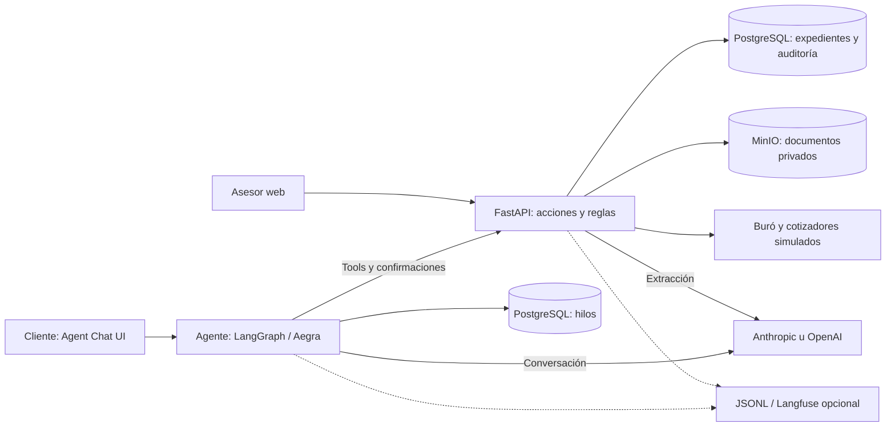
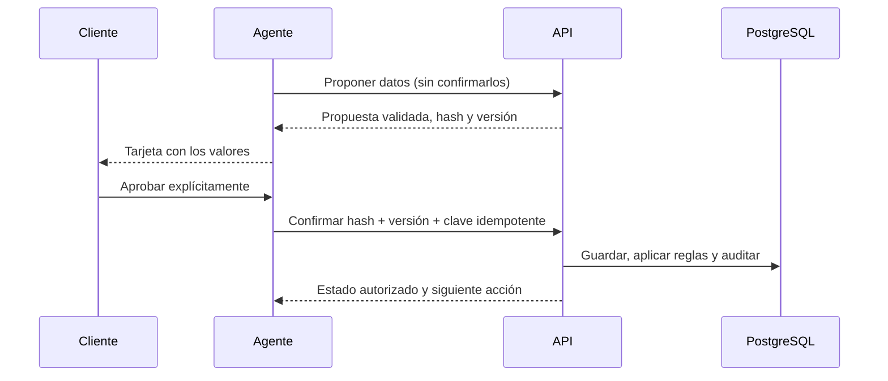

# Auto Equity Agent — documento de entrega

**Alcance:** preparar un expediente de crédito con garantía de auto, desde elegibilidad hasta
revisión financiera. No aprueba ni desembolsa créditos. Buró, cotizadores y políticas son
sintéticos; no se afirma integración con el backoffice real de Kavak/Kuna.

Este documento responde a los seis puntos técnicos del
[challenge original](../tdd/challenge_auto_equity_agent.pdf). El [README](../README.md) permite
arrancar; el [TDD](auto_equity_TDD.md) conserva contratos, operación y evidencia detallada.

## 1. Qué hace el agente y qué problema resuelve

Automatiza el contacto y la recolección: pregunta lo pendiente, propone datos, presenta ofertas,
recibe documentos y guía correcciones. **Opera el caso mediante herramientas; no es un FAQ.**
El agente se implementa con LangGraph y se sirve mediante Aegra. El modelo propone; la persona confirma;
FastAPI ejecuta las reglas y guarda el resultado.

El límite de integración con un sistema heredado son las acciones de `app/tools/` y los
adaptadores de proveedores. El prototipo persiste en su propia base; conectarlo al producto
real exigiría implementar esos contratos, no reemplazar silenciosamente la autoridad del caso.

## 2. Tools: contratos, permisos y efectos

El modelo tiene siete herramientas: consultar, proponer auto, proponer perfil, preparar
elección, subir documento, reintentar y pedir asesor. No dispone de SQL, shell ni una tool
para aprobar. Buró, llave, ofertas y el control final se ejecutan detrás de la API.

Cada comando valida esquema, actor, caso, etapa, `If-Match` e `Idempotency-Key`. La identidad
proviene del token, nunca del modelo. Un caso ajeno responde sin revelar su existencia.
El bloqueo del caso y la auditoría append-only protegen cambios concurrentes; agente y asesor
reutilizan la misma capa de acciones con permisos diferentes.

Las llamadas externas ocurren fuera del bloqueo. Se registra la operación antes de llamar
y se reconcilian resultados inciertos antes de repetir: no se promete «exactamente una vez»
si el proveedor no lo soporta.

## 3. Contexto y estado entre pasos

La base de la API conserva declaraciones, perfil, cotización de llave, ofertas, elección,
documentos, validaciones y revisiones. `consultar_solicitud` obtiene un snapshot vigente.
Aegra conserva el hilo y la tarjeta pendiente; **la conversación no es la fuente de verdad**.

Cambiar un ingreso, vehículo o documento invalida su evidencia dependiente. La elección
queda ligada a una oferta y su hash; una oferta vencida exige renovar y elegir otra vez.
Los reintentos recuperan el estado persistido, no vuelven a ejecutar todo a ciegas.

## 4. Determinismo frente a IA

| Etapa solicitada | Qué aporta la IA | Qué impone el código / dónde verlo |
| --- | --- | --- |
| Elegibilidad | Pregunta titularidad, adeudos y llave; propone respuestas | No titular o adeudo bloqueante: rechazo antes de Buró. Sin llave: continuar y cotizar. `app/domain/eligibility.py` |
| Perfilamiento | Captura datos para confirmación | Buró mock + política versionada derivan condiciones; no scoring LLM. `app/tools/credit.py`, `app/domain/policy.py` |
| Simulación y elección | Explica ofertas devueltas y prepara la tarjeta elegida | Cotizador simulado calcula; API valida cifras, vigencia y llave una sola vez. Solo la persona elige. `app/providers/offers.py`, `app/domain/simulation.py` |
| Datos y comprobantes | Clasifica y extrae campos con evidencia | Once reglas contrastan ingresos, identidad, empleo, fechas y vehículo. `app/domain/documents.py` |
| Dictamen | Explica resultado y corrección | El control final recalcula evidencia vigente bajo bloqueo. `app/tools/ready.py`, `app/domain/readiness.py` |

La política documental usa tolerancia inclusiva del 10 %, confianza mínima 0,90 por campo
y comprobantes de hasta 90 días: supuestos explícitos de demo, no calibración comercial.
Fechas solas no prueban frecuencia de pago; una instrucción impresa no prueba ingreso neto.
La confianza del modelo tampoco es una probabilidad calibrada ni una garantía antifraude.

## 5. Guardrails y revisión humana

Antes de listo se revalidan elegibilidad, perfil, llave, oferta, elección y todos los documentos;
no puede haber revisión, corrección u operación material pendiente. Una lectura dudosa bloquea,
no modifica lo declarado para hacerlo coincidir. Dos rondas fallidas, una operación incierta,
presupuesto agotado o una solicitud del cliente abren revisión humana.

El asesor asignado ve declaraciones, evidencia privada, reglas y auditoría. Puede pedir
corrección, registrar una lectura humana, conciliar una operación o reanudar tras resolverla.
**No tiene un botón que salte las reglas.** El modelo no puede otorgarse verificación humana.

Los cierres sensibles se construyen desde el estado de la API antes de publicar texto:
sin códigos internos ni promesas de aprobación, desembolso o contacto no implementado.
Cerrar el expediente bloquea cambios, no consultas: el chat puede explicar la oferta
seleccionada y el proceso con datos del backend. La corrección de ingresos respeta la
periodicidad: un recibo quincenal no tiene que mostrar el importe mensual declarado.
Los presupuestos limitan consumo; un fallo técnico pausa o escala, nunca rechaza un crédito.

## 6. Observabilidad y calidad medida

Auditoría en PostgreSQL; trazas sanitizadas en JSONL y Langfuse opcional. El contexto de traza
une agente → API → extracción. Se mide latencia real de generación, uso y costo estimado;
el ejemplo incluye tarifas configurables de `gpt-4.1-mini` ([TDD §10.2](auto_equity_TDD.md#102-uso-costos-y-diagnóstico)).
Sin tarifa, el costo es desconocido; no es una factura ni altera los límites por tokens.
No se exportan conversaciones ni documentos completos.

Las evaluaciones usan etiquetas externas al modelo para contar rechazos correctos, mismatches,
falsos OK, costo de llave sin duplicación y completitud. Contar correcciones en producción
no demuestra por sí solo cuántos errores pasaron inadvertidos.

**Evidencia de ejecución, no solo diseño:** el
[CI de `9e79e24`](https://github.com/nemis-coder/auto-equity-agent/actions/runs/36639163426)
pasó build, arranque limpio, Ruff, **442 pruebas backend, 52 del grafo, 15 de presentación,
cuatro demos y 37 escenarios**. Sin llamadas a modelos. Además hay un recorrido histórico
con OpenAI real, respuestas separadas, tres aprobaciones y corrección documental en navegador.
Alcance, configuración y fuentes en [TDD §8.4](auto_equity_TDD.md#84-evidencia-y-limitaciones).

**Límite abierto:** el holdout histórico `gpt-4.1-mini` / prompt v2 produjo **4/15 falsos OK**.
Reproducir sus 72 lecturas con las reglas actuales los bloquea (**0/15; 9/9 válidos**), pero
la abstención correcta sigue en **27/30** y el resultado en **FAIL**. Esto mejora el control,
no demuestra mejor lectura. El prompt v3 necesita evaluación real con un holdout nuevo.

## Decisiones, razonamiento y trade-offs

| Elegimos | Por qué / costo aceptado |
| --- | --- |
| Un agente y reglas en API | Una sola autoridad de negocio; menos flexibilidad que dejar decidir al modelo, más verificabilidad |
| Tarjetas humanas y respuesta revisada antes de publicarse | Consentimiento y mensajes consistentes; más interacción y sin escritura token a token |
| PostgreSQL de negocio separado del de Aegra; MinIO privado | Separar vida del expediente, hilo y archivo; más contenedores y mantenimiento |
| Dos proveedores explícitos por función | Portabilidad sin gateway ni fallback; matriz de pruebas y calidad por modelo, no equivalencia automática |
| Matching y evidencia conservadores | Menos aceptación sin respaldo; formatos legítimos pueden requerir asesor. No sustituye antifraude |
| Fixtures y evaluación real separadas | Regresión reproducible sin costo; no atribuir inteligencia a un mock ni ocultar el FAIL real |

Prioricé transiciones correctas, elección explícita, recuperación y evidencia. No añadí RAG,
colas, un segundo agente ni integraciones financieras ficticias. La principal deuda antes de
usar datos reales es calidad documental independiente, junto con identidad, políticas e
integraciones de producción; no una arquitectura más grande.

## Cómo demostrarlo

Arranque y acceso en el [README](../README.md); comandos seguros en
[TDD §11](auto_equity_TDD.md#11-despliegue-y-ejecución). `scripts/demo.py --scenario all`
recorre los endpoints con un cliente guionado y el extractor configurado:

Los cuatro primeros enlaces corresponden a esas demos HTTP. El último es un recorrido
adicional de chat y asesor (D15), respaldado por pruebas de integración y navegador.

| Demo | Resultado que debe observarse |
| --- | --- |
| [happy_path](../conversation/demo_ana.md) | Documentos consistentes → listo para revisión, no aprobación |
| [vehicle_not_owned](../conversation/demo_rechazo_auto.md) | Rechazo de elegibilidad sin consultar Buró |
| [document_income_mismatch](../conversation/demo_validacion_documental.md) | Corrección del ingreso, nunca listo mientras persista la discrepancia |
| [missing_second_key](../conversation/demo_sin_segunda_llave.md) | Llave de $3,000 integrada una vez: capital $53,000 para $50,000 de efectivo |
| [Revisión humana — D15](../conversation/demo_revision_humana.md) | Dos rondas fallidas → asesor verifica el monto → backend revalida → cliente consulta el cierre |

Para mostrar el agente real, usar un hilo nuevo, **responder una pregunta por turno** y aprobar
las tarjetas; adjuntar identificación, nómina y titularidad por separado. El guion y los
archivos están en [TDD §11.3](auto_equity_TDD.md#113-demo-progresiva). Las demos HTTP y el
grafo guionado son respaldo técnico, no se presentan como una conversación con IA real.
